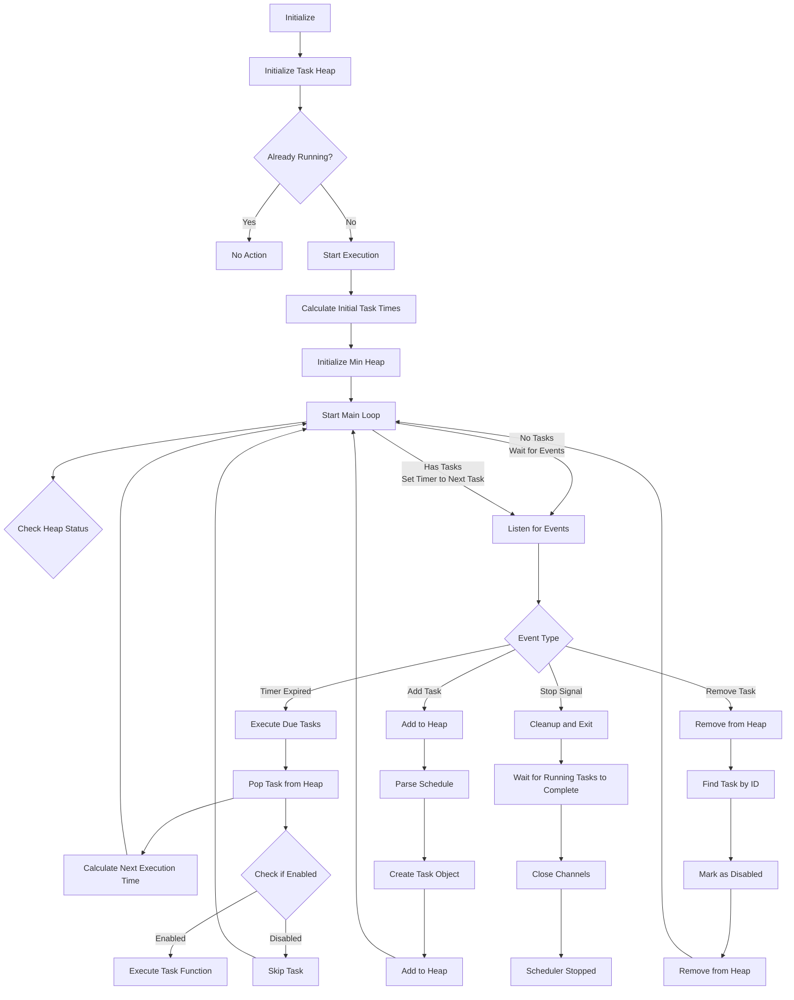
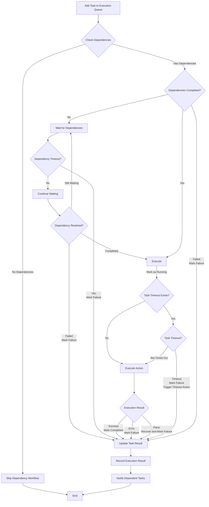

> [!NOTE]
> This README was translated by ChatGPT 4o

# Cron Scheduler

> A lightweight Golang scheduler supporting standard cron expressions, custom descriptors, custom intervals, and task dependencies. Easily write schedules using Go.<br>
> Originally designed for [pardnchiu/go-ip-sentry](https://github.com/pardnchiu/go-ip-sentry) to handle threat score decay calculations.


[](LICENSE)
[](https://github.com/pardnchiu/go-cron/releases)
<br>
[](README.md)
[](README.zh.md) 

## Key Features

### Flexible Syntax
Supports standard cron expressions, custom descriptors (`@hourly`, `@daily`, `@weekly`, etc.), and custom interval syntax (`@every`). Minimal learning curve—if you know cron expressions, you can use this scheduler.

### Task Dependencies
Supports pre-task dependencies, multi-dependencies, timeout control for dependencies, and failure handling mechanisms.

### Efficient Architecture
Built using Golang's standard `heap` library, focusing on core functionality. Implements task scheduling based on a min-heap, concurrent task execution and management, panic recovery, dynamic task addition/removal, and ensures optimal performance in scenarios with numerous tasks.

## Flowcharts

<details>
<summary>Main Workflow</summary> 



</details>

<details>
<summary>Dependency Workflow</summary>



</details>

## Dependencies

- ~~[`github.com/pardnchiu/go-logger`](https://github.com/pardnchiu/go-logger)~~ (< v0.3.1)<br>
  Starting from `v0.3.1`, non-standard libraries are deprecated for performance and stability. Replaced with `log/slog`.

## Usage

### Installation
```bash
go get github.com/pardnchiu/go-cron
```

### Initialization

#### Basic Usage
```go
package main

import (
  "fmt"
  "log"
  "time"
  
  cron "github.com/pardnchiu/go-cron"
)

func main() {
  // Initialize (optional configuration)
  scheduler, err := cron.New(cron.Config{
    Location: time.Local,
  })
  if err != nil {
    log.Fatal(err)
  }
  
  // Start scheduler
  scheduler.Start()
  
  // Add tasks
  id1, _ := scheduler.Add("@daily", func() {
    fmt.Println("Daily execution")
  }, "Backup task")
  
  id2, _ := scheduler.Add("@every 5m", func() {
    fmt.Println("Execute every 5 minutes")
  })
  
  // View task list
  tasks := scheduler.List()
  fmt.Printf("Currently have %d tasks\n", len(tasks))
  
  // Remove specific task
  scheduler.Remove(id1)
  
  // Remove all tasks
  scheduler.RemoveAll()
  
  // Graceful shutdown
  ctx := scheduler.Stop()
  <-ctx.Done()
}
```

#### Task Dependencies
```go
package main

import (
  "fmt"
  "log"
  "time"
  
  cron "github.com/pardnchiu/go-cron"
)

func main() {
  scheduler, err := cron.New(cron.Config{})
  if err != nil {
    log.Fatal(err)
  }
  
  scheduler.Start()
  defer func() {
    ctx := scheduler.Stop()
    <-ctx.Done()
  }()
  
  // Task A: Data preparation
  taskA, _ := scheduler.Add("0 1 * * *", func() error {
    fmt.Println("Preparing data...")
    time.Sleep(2 * time.Second)
    return nil
  }, "Data preparation")
  
  // Task B: Data processing  
  taskB, _ := scheduler.Add("0 2 * * *", func() error {
    fmt.Println("Processing data...")
    time.Sleep(3 * time.Second)
    return nil
  }, "Data processing")
  
  // Task C: Report generation (depends on A and B)
  taskC, _ := scheduler.Add("0 3 * * *", func() error {
    fmt.Println("Generating report...")
    time.Sleep(1 * time.Second)
    return nil
  }, "Report generation", []int64{taskA, taskB})
  
  // Task D: Email sending (depends on C)
  _, _ = scheduler.Add("0 4 * * *", func() error {
    fmt.Println("Sending email...")
    return nil
  }, "Email notification", []int64{taskC})
  
  time.Sleep(10 * time.Second)
}
```

## Configuration
```go
type Config struct {
  Location *time.Location // Timezone setting (default: time.Local)
}
```

## Supported Formats

### Standard
> 5-field format: `minute hour day month weekday`<br>
> Supports range syntax `1-5` and `1,3,5`

```go
// Every minute
scheduler.Add("* * * * *", task)

// Daily at midnight
scheduler.Add("0 0 * * *", task)

// Every 15 minutes
scheduler.Add("*/15 * * * *", task)

// First day of month at 6 AM
scheduler.Add("0 6 1 * *", task)

// Monday to Wednesday, and Friday
scheduler.Add("0 0 * * 1-3,5", task)
```

### Custom
```go
// January 1st at midnight
scheduler.Add("@yearly", task)

// First day of month at midnight
scheduler.Add("@monthly", task)

// Every Sunday at midnight
scheduler.Add("@weekly", task)

// Daily at midnight
scheduler.Add("@daily", task)

// Every hour on the hour
scheduler.Add("@hourly", task)

// Every 30 seconds (minimum interval: 30 seconds)
scheduler.Add("@every 30s", task)

// Every 5 minutes
scheduler.Add("@every 5m", task)

// Every 2 hours
scheduler.Add("@every 2h", task)

// Every 12 hours
scheduler.Add("@every 12h", task)
```

## Available Functions

### Scheduler Management

- `New()` - Create a new scheduler instance
  ```go
  scheduler, err := cron.New(config)
  ```
  - Sets up task heap and communication channels

- `Start()` - Start the scheduler instance
  ```go
  scheduler.Start()
  ```
  - Starts the scheduling loop

- `Stop()` - Stop the scheduler
  ```go
  ctx := scheduler.Stop()
  <-ctx.Done() // Wait for all tasks to complete
  ```
  - Sends a stop signal to the main loop
  - Returns a context that completes when all running tasks finish
  - Ensures graceful shutdown without interrupting tasks

### Task Management

- `Add()` - Add a scheduled task
  ```go
  // Basic usage (no return value)
  taskID, err := scheduler.Add("0 */2 * * *", func() {
    // Task logic
  })

  // Task with error return (supports dependencies)
  taskID, err := scheduler.Add("@daily", func() error {
    // Task logic
    return nil
  }, "Backup task")

  // Task with timeout control
  taskID, err := scheduler.Add("@hourly", func() error {
    // Long-running task
    time.Sleep(10 * time.Second)
    return nil
  }, "Data processing", 5*time.Second)

  // Task with timeout callback
  taskID, err := scheduler.Add("@daily", func() error {
    // Potentially timeout-prone task
    return heavyProcessing()
  }, "Critical backup", 30*time.Second, func() {
    log.Println("Backup task timed out, please check system status")
  })

  // Task with dependencies
  taskID, err := scheduler.Add("@daily", func() error {
    // Task that depends on other tasks
    return processData()
  }, "Data processing", []int64{taskA, taskB})

  // Task with dependencies and timeout
  taskID, err := scheduler.Add("@daily", func() error {
    return generateReport()
  }, "Report generation", []int64{taskA, taskB}, 10*time.Minute)
  ```
  - Parses scheduling syntax
  - Generates a unique task ID for management
  - Supports variable parameter configurations
    - `string`: Task description
    - `time.Duration`: Task execution timeout
    - `func()`: Timeout callback function
    - `[]int64`: Dependency task ID list
  - Supports two types of action functions
    - `func()`: No error return, no dependency support
    - `func() error`: Error return, supports dependencies

- `Remove()` - Cancel a scheduled task
  ```go
  scheduler.Remove(taskID)
  ```
  - Removes the task from the scheduling queue
  - Safe to call regardless of scheduler state

- `RemoveAll()` - Remove all tasks
  ```go
  scheduler.RemoveAll()
  ```
  - Immediately removes all scheduled tasks
  - Does not affect tasks currently running

- `List()` - Retrieve the task list
  ```go
  tasks := scheduler.List()
  ```

## Task Dependencies 

### Basic Usage
- No dependencies: Executes directly
- With dependencies: Executes using a worker pool and dependency manager
  - Single dependency: Task B executes after Task A completes
  - Multiple dependencies: Task C waits for both Task A and B to complete before executing
  - Dependency timeout: Maximum wait time for dependent tasks to complete (default: 1 minute)
    

### Task States
```go
const (
    TaskPending     // Waiting
    TaskRunning     // Running 
    TaskCompleted   // Completed
    TaskFailed      // Failed / Timeout
    TaskSkipped     // Skipped (will add skip parameter)
)
```

## Timeout Mechanism
When execution time exceeds the configured `Delay`:
- Interrupts task execution
- Triggers the `OnDelay` function (if configured)
- Logs timeout events
- Continues with the next scheduled task

### Features
- Timeout implemented using `context.WithTimeout`
- Timeout does not affect other task executions
- If the action completes before timeout, no timeout is triggered

## Upcoming Features

### Enhanced Task Dependencies

- Custom timeout: Replace fixed 1-minute timeout with user-defined settings
- Failure actions: Set dependency failure behavior to `Skip` (skip current task) or `Stop` (stop entire dependency chain), enabling flexible error handling
- Status callbacks: Add `OnTimeout` and `OnFailed` callback functions for monitoring and responding to abnormal dependency states

### Task Completion Trigger Rewrite

- Event-driven: Replace current polling with a fully `channel`-based model to reduce CPU usage
- Dependency wake-up: Implement active notification mechanism for dependent task completion, eliminating unnecessary polling checks

## License

This project is licensed under [MIT](LICENSE).

## Author


<h4 style="padding-top: 0">邱敬幃 Pardn Chiu</h4>

<a href="mailto:dev@pardn.io" target="_blank">
  
</a> <a href="https://linkedin.com/in/pardnchiu" target="_blank">
  
</a>

***

©️ 2025 [邱敬幃 Pardn Chiu](https://pardn.io)