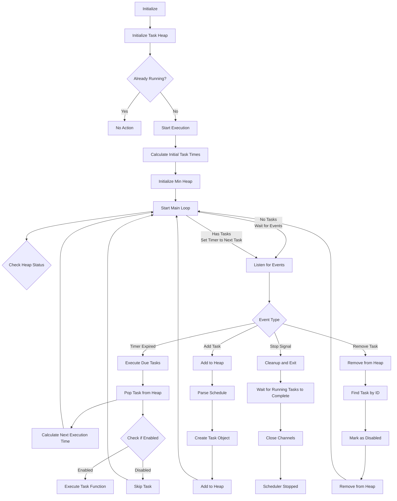
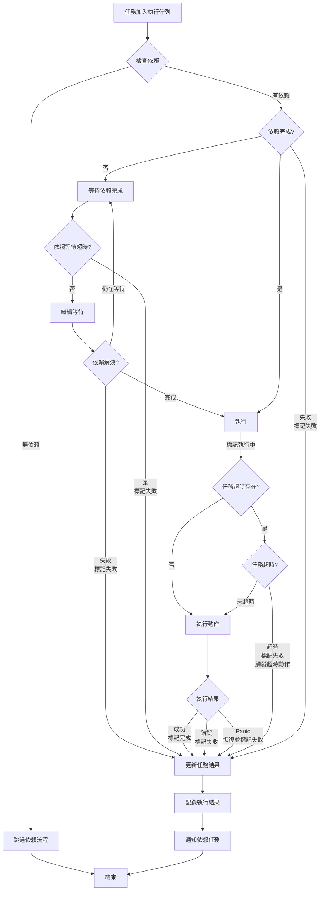

# Cron Scheduler

> A lightweight Golang scheduler supporting standard cron expressions, custom descriptors, custom intervals, and task dependencies. Easy to use for writing scheduling with Golang.<br>
> *輕量的 Golang 排程器，支援標準 cron 表達式、自定義描述符、自訂間隔和任務依賴關係。輕鬆使用 Go 撰寫排程*<br>
>
> Originally designed for the scheduling used in threat score decay calculations for [pardnchiu/go-ip-sentry](https://github.com/pardnchiu/go-ip-sentry).<br>
> *原本是設計給 [pardnchiu/go-ip-sentry](https://github.com/pardnchiu/go-ip-sentry) 威脅分數衰退計算所使用到的排程功能*


[](LICENSE)
[](https://github.com/pardnchiu/go-cron/releases)

## Three Core Features / 三大核心特色

### Flexible Syntax / 靈活語法
Supports standard cron expressions, custom descriptors (`@hourly`, `@daily`, `@weekly`, etc.) and custom interval (`@every`) syntax. Zero learning curve, if you know how to write cron expressions, you know how to use it<br>
*支援標準 cron 表達式、自定義描述符（`@hourly`、`@daily`、`@weekly` 等）和自訂間隔（`@every`）語法，零學習成本，只要會寫 cron 表達式就基本會使用*

### Task Dependencies / 任務依賴
Supports pre-dependencies, multiple dependencies, dependency timeout control and failure handling mechanisms<br>
*支援前置依賴任務、多重依賴、依賴超時控制和失敗處理機制*

### Efficient Architecture / 高效架構
Uses Golang standard library `heap`, focuses on core feature, min-heap based task scheduling, concurrent task execution and management, with panic recovery mechanism and dynamic task add/remove, ensuring performance under heavy task<br>
*使用 Golang 標準庫的 `heap`，專注核心功能，基於最小堆的任務排程，併發的任務執行和管理，具有 panic 恢復機制和動態任務新增/移除功能，並確保在大量任務場景中的最佳效能*

## Flow / 流程圖

<details>
<summary>Major / 主流程</summary> 



</details>

<details>
<summary>Task Dependence / 依賴流程</summary>



</details>

## Dependencies / 依賴套件

- ~~[`github.com/pardnchiu/go-logger`](https://github.com/pardnchiu/go-logger)~~ (< v0.3.1)<br>
  Deprecated since `v0.3.1` for improved performance and stability, now using `log/slog` from standard library.<br>
  *為了效能與穩定度，`v0.3.1` 起棄用非標準庫套件，改用 `log/slog`*

## How to use / 使用方法

### Installation / 安裝
```bash
go get github.com/pardnchiu/go-cron
```

### Initialization / 初始化

#### Basic Usage / 基本使用
```go
package main

import (
  "fmt"
  "log"
  "time"
  
  cron "github.com/pardnchiu/go-cron"
)

func main() {
  // Initialize (optional configuration)
  scheduler, err := cron.New(cron.Config{
    Location: time.Local,
  })
  if err != nil {
    log.Fatal(err)
  }
  
  // Start scheduler
  scheduler.Start()
  
  // Add tasks
  id1, _ := scheduler.Add("@daily", func() {
    fmt.Println("Daily execution")
  }, "Backup task")
  
  id2, _ := scheduler.Add("@every 5m", func() {
    fmt.Println("Execute every 5 minutes")
  })
  
  // View task list
  tasks := scheduler.List()
  fmt.Printf("Currently have %d tasks\n", len(tasks))
  
  // Remove specific task
  scheduler.Remove(id1)
  
  // Remove all tasks
  scheduler.RemoveAll()
  
  // Graceful shutdown
  ctx := scheduler.Stop()
  <-ctx.Done()
}
```

#### Task Dependencies / 任務依賴
```go
package main

import (
  "fmt"
  "log"
  "time"
  
  cron "github.com/pardnchiu/go-cron"
)

func main() {
  scheduler, err := cron.New(cron.Config{})
  if err != nil {
    log.Fatal(err)
  }
  
  scheduler.Start()
  defer func() {
    ctx := scheduler.Stop()
    <-ctx.Done()
  }()
  
  // Task A: Data preparation
  taskA, _ := scheduler.Add("0 1 * * *", func() error {
    fmt.Println("Preparing data...")
    time.Sleep(2 * time.Second)
    return nil
  }, "Data preparation")
  
  // Task B: Data processing  
  taskB, _ := scheduler.Add("0 2 * * *", func() error {
    fmt.Println("Processing data...")
    time.Sleep(3 * time.Second)
    return nil
  }, "Data processing")
  
  // Task C: Report generation (depends on A and B)
  taskC, _ := scheduler.Add("0 3 * * *", func() error {
    fmt.Println("Generating report...")
    time.Sleep(1 * time.Second)
    return nil
  }, "Report generation", []int64{taskA, taskB})
  
  // Task D: Email sending (depends on C)
  _, _ = scheduler.Add("0 4 * * *", func() error {
    fmt.Println("Sending email...")
    return nil
  }, "Email notification", []int64{taskC})
  
  time.Sleep(10 * time.Second)
}
```

## Configuration / 配置介紹
```go
type Config struct {
  Location *time.Location // Timezone setting (default: time.Local)
}
```

## Supported / 支援格式

### Standard / 標準
> 5-field format: `minute hour day month weekday`<br>
> *5 欄位格式：`分鐘 小時 日 月 星期`*<br>
> 
> `1-5` and `1,3,5` are supported<br>
> *支援範圍語法 `1-5` 和 `1,3,5`*

```go
// Every minute
scheduler.Add("* * * * *", task)

// Daily at midnight
scheduler.Add("0 0 * * *", task)

// Every 15 minutes
scheduler.Add("*/15 * * * *", task)

// First day of month at 6 AM
scheduler.Add("0 6 1 * *", task)

// Monday to Wednesday, and Friday
scheduler.Add("0 0 * * 1-3,5", task)
```

### Custom / 自定義
```go
// January 1st at midnight
scheduler.Add("@yearly", task)

// First day of month at midnight
scheduler.Add("@monthly", task)

// Every Sunday at midnight
scheduler.Add("@weekly", task)

// Daily at midnight
scheduler.Add("@daily", task)

// Every hour on the hour
scheduler.Add("@hourly", task)

// Every 30 seconds (minimum interval: 30 seconds)
scheduler.Add("@every 30s", task)

// Every 5 minutes
scheduler.Add("@every 5m", task)

// Every 2 hours
scheduler.Add("@every 2h", task)

// Every 12 hours
scheduler.Add("@every 12h", task)
```

## Functions / 可用函式

### Scheduler Management / 排程管理

- `New()` - Create scheduler instance / 建立新的排程實例
  ```go
  scheduler, err := cron.New(config)
  ```
  - Sets up task heap and communication channels<br>
    *設置任務堆和通訊通道*

- `Start()` - Start scheduler instance / 啟動排程實例
  ```go
  scheduler.Start()
  ```
  - Starts scheduling loop<br>
    *啟動排程迴圈*

- `Stop()` - Stop scheduler / 停止排程器
  ```go
  ctx := scheduler.Stop()
  <-ctx.Done() // Wait for all tasks to complete
  ```
  - Sends stop signal to main loop<br>
    *向主迴圈發送停止信號*
  - Returns context that completes when all running tasks finish<br>
    *回傳在所有執行中任務完成時完成的 context*
  - Ensures graceful shutdown without interrupting tasks<br>
    *確保不中斷任務的關閉*

### Task Management / 任務管理

- `Add()` - Add task / 新增排程任務
  ```go
  // Basic usage (no return value)
  taskID, err := scheduler.Add("0 */2 * * *", func() {
    // Task logic
  })

  // Task with error return (supports dependencies)
  taskID, err := scheduler.Add("@daily", func() error {
    // Task logic
    return nil
  }, "Backup task")

  // Task with timeout control
  taskID, err := scheduler.Add("@hourly", func() error {
    // Long-running task
    time.Sleep(10 * time.Second)
    return nil
  }, "Data processing", 5*time.Second)

  // Task with timeout callback
  taskID, err := scheduler.Add("@daily", func() error {
    // Potentially timeout-prone task
    return heavyProcessing()
  }, "Critical backup", 30*time.Second, func() {
    log.Println("Backup task timed out, please check system status")
  })

  // Task with dependencies
  taskID, err := scheduler.Add("@daily", func() error {
    // Task that depends on other tasks
    return processData()
  }, "Data processing", []int64{taskA, taskB})

  // Task with dependencies and timeout
  taskID, err := scheduler.Add("@daily", func() error {
    return generateReport()
  }, "Report generation", []int64{taskA, taskB}, 10*time.Minute)
  ```
  - Parses schedule syntax<br>
    *解析排程語法*
  - Generates unique task ID for management<br>
    *產生唯一的任務 ID 以便管理*
  - Supports variadic parameter configuration<br>
    *支援可變參數配置*
    - `string`: Task description<br>
      `string`*：任務描述*
    - `time.Duration`: Task execution timeout<br>
      `time.Duration`*：任務執行超時時間*
    - `func()`: Callback function triggered on timeout<br>
      `func()`*：超時觸發的回調函式*
    - `[]int64`: List of dependence task ID<br>
      `[]int64`*：依賴任務 ID 列表*
  - Supports two action function types<br>
    *支援兩種動作函式*
    - `func()`: No error return, dependencies not supported<br>
      `func()`*：無錯誤返回，不支援依賴*
    - `func() error`: With error return, dependencies supported<br>
      `func() error`*：有錯誤返回，支援依賴*

- `Remove()` - Cancel task / 取消任務排程
  ```go
  scheduler.Remove(taskID)
  ```
  - Removes task from scheduling queue<br>
    *從排程佇列中移除任務*
  - Safe to call regardless of scheduler state<br>
    *無論排程器狀態如何都可安全呼叫*

- `RemoveAll()` -  Remove all tasks / 移除所有任務
  ```go
  scheduler.RemoveAll()
  ```
  - Immediately removes all scheduled tasks<br>
    *立即移除所有排程任務*
  - Does not affect currently running tasks<br>
    *不影響正在執行的任務*

- `List()` - Get task list / 獲取任務列表<br>
  ```go
  tasks := scheduler.List()
  ```

## Task Dependence / 任務依賴 

### Basic usage / 基本使用
- Independent: Direct execution<br>
  *無依賴：直接執行*
- Dependent: Execute through worker pool and dependency manager<br>
  *有依賴：透過 worker 池和依賴管理器執行*
  - Single dependence: Task B executes after Task A completes<br>
    *單一依賴：任務 B 在任務 A 完成後執行*
  - Multiple dependencies: Task C waits for both Tasks A and B to complete before executing<br>
    *多重依賴：任務 C 等待任務 A、B 全部完成後執行*
  - Dependency timeout: Maximum time to wait for dependency completion (default 1 min)<br>
    *依賴任務超時：等待依賴任務完成的最大時間（預設 1 分鐘）*
    

### Status / 任務狀態
```go
const (
    TaskPending     // Waiting / 等待執行
    TaskRunning     // Running / 執行中
    TaskCompleted   // Completed / 完成
    TaskFailed      // Failed / Timeout / 失敗 / 超時
    TaskSkipped     // Skipped (will add skip parameter) / 跳過（後續會導入 skip 參數）
)
```

## Timeout / 超時機制
When execution time exceeds the configured `Delay`<br>
*當執行時間超過設定的 `Delay`*
- Interrupts task execution<br>
  *中斷任務執行*
- Triggers `OnDelay` function (if configured)<br>
  *觸發 `OnDelay` 函式（如果有設定）*
- Logs timeout event<br>
  *記錄超時日誌*
- Continues with next scheduled task<br>
  *繼續執行下一個排程*

### Features / 特點
- Timeout implemented using `context.WithTimeout`<br>
  *超時使用 `context.WithTimeout` 實現* 
- Timeout does not affect execution of other tasks<br>
  *超時不會影響其他任務的執行*
- If action completes before timeout, timeout is not triggered<br>
  *如果動作在超時前完成，不會觸發超時*

## Upcoming / 功能預告

### Enhanced Task Dependencies / 任務依賴增強

- Custom Timeout: Replace the fixed 1-minute timeout with user-defined settings.<br>
  *自行設置超時：移除固定的 1 分鐘超時，改為用戶自行設定*
- Failure Action: Configure dependency failure handling as either `Skip` (skip the current task) or `Stop` (halt the entire dependency chain) for more flexible error management.<br>
  *失敗動作：可提前設置依賴失敗時是 `Skip`（跳過當前任務）或 `Stop`（停止整個依賴鏈），提供更靈活的錯誤處理*
- Status Callback: Add `OnTimeout` and `OnFailed` callback functions to monitor and respond to abnormal dependency states.<br>
  *狀態回調：新增 OnTimeout 和 OnFailed 回調函數，方便監控和響應依賴任務的異常狀態*

### Task Done Trigger / 任務完成觸發改寫

- Event-Driven: Transition from polling to a fully `channel`-based model to reduce CPU usage.
  *事件驅動：將當前的輪詢改為完全基於 `channel` 的模式，降低 CPU 使用率*
- Dependency Wake-Up: Implement proactive notification mechanisms for completed dependency tasks, eliminating unnecessary polling checks.
  *依賴喚醒：實作依賴任務完成時的主動通知機制，消除無效的輪詢檢查*

## License / 授權條款

This project is licensed under the [MIT](LICENSE) License.<br>
*此專案採用 [MIT](LICENSE) 授權條款。*

## Author / 作者


<h4 style="padding-top: 0">邱敬幃 Pardn Chiu</h4>

<a href="mailto:dev@pardn.io" target="_blank">
  
</a> <a href="https://linkedin.com/in/pardnchiu" target="_blank">
  
</a>

***

©️ 2025 [邱敬幃 Pardn Chiu](https://pardn.io)