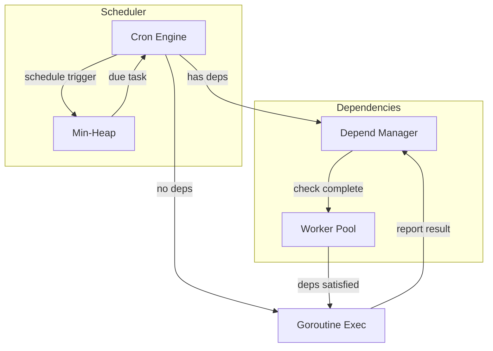

> [!NOTE]
> This README was generated by [SKILL](https://github.com/pardnchiu/skill-readme-generate), get the ZH version from [here](./README.zh.md).

# go-scheduler

[](https://pkg.go.dev/github.com/pardnchiu/go-scheduler)
[](https://goreportcard.com/report/github.com/pardnchiu/go-scheduler)
[](https://app.codecov.io/github/pardnchiu/go-scheduler)
[](LICENSE)
[](https://github.com/pardnchiu/go-scheduler/releases)

> Lightweight Go task scheduler with cron syntax, task dependency chains, and failure strategy control.

## Table of Contents

- [Features](#features)
- [Architecture](#architecture)
- [File Structure](#file-structure)
- [License](#license)
- [Author](#author)
- [Stars](#stars)

## Features

> `go get github.com/pardnchiu/go-scheduler` · [Documentation](./doc.md)

### Cron Scheduling with Live Dispatch

Supports standard five-field cron expressions and preset descriptors like `@every` and `@daily`. A min-heap sorts trigger times so the next due task is woken with minimal overhead. Tasks can be added or removed dynamically while the scheduler is running, with no restart required.

### Task Dependency Chains with Failure Strategies

Tasks can declare dependencies on other tasks, and the scheduler automatically blocks execution until prerequisites complete. Two failure strategies are provided: Skip ignores the failure and proceeds, while Stop aborts the entire dependency chain. Each dependency accepts an independent timeout to prevent a single stalled task from blocking the whole schedule.

### Concurrency-Safe Execution with Panic Recovery

Each task runs in its own goroutine, with mutex and channel coordination ensuring consistent state. Panics are automatically recovered so one failing task never crashes the scheduler. Context-based timeouts trigger an onDelay callback, giving callers a hook for cleanup logic.

## Architecture



## File Structure

```
go-scheduler/
├── instance.go          # Scheduler creation, start, stop, and task execution
├── add.go               # Task addition and argument parsing
├── remove.go            # Task removal
├── task.go              # Task listing and heap implementation
├── schedule.go          # Cron expression and descriptor parsing
├── type.go              # Type definitions and constants
├── depend.go            # Dependency worker pool and task execution
├── dependManager.go     # Dependency checking, waiting, and state updates
├── cron_test.go         # Unit tests and benchmarks
├── go.mod
└── LICENSE
```

## License

This project is licensed under the [MIT LICENSE](LICENSE).

## Author


<h4 style="padding-top: 0">邱敬幃 Pardn Chiu</h4>

<a href="mailto:dev@pardn.io" target="_blank">

</a> <a href="https://linkedin.com/in/pardnchiu" target="_blank">

</a>

## Stars

[](https://www.star-history.com/#pardnchiu/go-scheduler&Date)

***

©️ 2025 [邱敬幃 Pardn Chiu](https://linkedin.com/in/pardnchiu)
