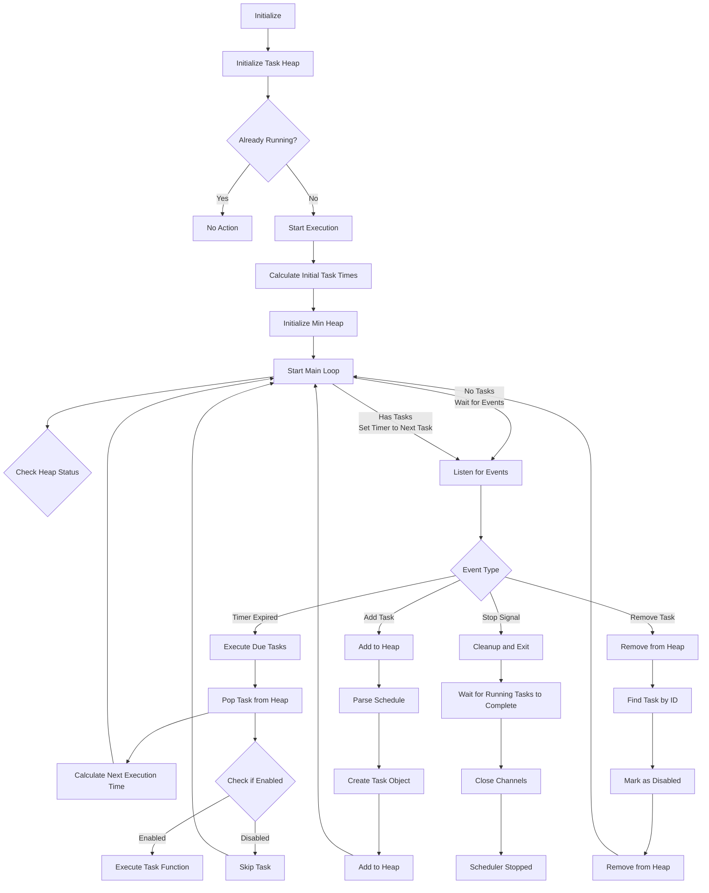

# Cron Scheduler

> 輕量的 Golang 排程器，支援標準 cron 表達式、自定義描述符和自訂間隔。輕鬆使用 Go 撰寫排程。<br>
> A lightweight Golang scheduler supporting standard cron expressions, custom descriptors, and custom intervals. Easy to use for writing scheduling with Golang.<br>
>
> 原本是設計給 [pardnchiu/go-ip-sentry](https://github.com/pardnchiu/go-ip-sentry) 威脅分數衰退計算所使用到的排程功能。<br>
> Originally designed for the scheduling used in threat score decay calculations for [pardnchiu/go-ip-sentry](https://github.com/pardnchiu/go-ip-sentry).


[](LICENSE)
[](https://github.com/pardnchiu/go-cron/releases)

## 三大核心特色 / Three Core Features

### 零學期成本 / Zero Learning curve
零學習成本，只要會寫 cron 表達式就基本會使用<br>
Zero learning curve, if you know how to write cron expressions, you know how to use it

### 靈活語法 / Flexible Syntax
支援標準 cron 表達式、自定義描述符（`@hourly`、`@daily`、`@weekly` 等）和自訂間隔（`@every`）語法<br>
Supports standard cron expressions, custom descriptors (`@hourly`, `@daily`, `@weekly`, etc.) and custom interval (`@every`) syntax

### 高效架構 / Efficient Architecture
使用 Golang 標準庫的 `heap`，專注核心功能，基於最小堆的任務排程，併發的任務執行和管理，具有 panic 恢復機制和動態任務新增/移除功能，並確保在大量任務場景中的最佳效能<br>
Uses Golang standard library `heap`, focuses on core feature, min-heap based task scheduling, concurrent task execution and management, with panic recovery mechanism and dynamic task add/remove, ensuring performance under heavy task

## 流程圖 / Flow

<details>
<summary>點擊查看</summary>



</details>

## 依賴套件 / Dependencies

- ~~[`github.com/pardnchiu/go-logger`](https://github.com/pardnchiu/go-logger)~~ (< v0.3.1)<br>
  為了效能與穩定度，`v0.3.1` 起棄用非標準庫套件，改用 `log/slog`<br>
  Deprecated since `v0.3.1` for improved performance and stability, now using `log/slog` from standard library.

## 使用方法 / How to use

### 安裝 / Installation
```bash
go get github.com/pardnchiu/go-cron
```

### 初始化 / Initialization
```go
package main

import (
  "fmt"
  "log"
  "time"
  
  cron "github.com/pardnchiu/go-cron"
)

func main() {
  // Initialize (optional configuration)
  scheduler, err := cron.New(cron.Config{
    Location: time.Local,
  })
  if err != nil {
    log.Fatal(err)
  }
  
  // Start scheduler
  scheduler.Start()
  
  // Add tasks
  id1, _ := scheduler.Add("@daily", func() {
    fmt.Println("Daily execution")
  }, "Backup task")
  
  id2, _ := scheduler.Add("@every 5m", func() {
    fmt.Println("Execute every 5 minutes")
  })
  
  // View task list
  tasks := scheduler.List()
  fmt.Printf("Currently have %d tasks\n", len(tasks))
  
  // Remove specific task
  scheduler.Remove(id1)
  
  // Remove all tasks
  scheduler.RemoveAll()
  
  // Graceful shutdown
  ctx := scheduler.Stop()
  <-ctx.Done()
}
```

## 配置介紹 / Configuration
```go
type Config struct {
  Location *time.Location // Timezone setting (default: time.Local)
}
```

## 支援格式 / Supported

### 標準 / Standard
> 5 欄位格式：`分鐘 小時 日 月 星期`<br>
> 5-field format: `minute hour day month weekday`<br>
> 
> 目前版本暫不支援範圍語法 `1-5` 和 `1,3,5`<br>
> `1-5` and `1,3,5` are not yet supported

```go
// Every minute
scheduler.Add("* * * * *", task)

// Daily at midnight
scheduler.Add("0 0 * * *", task)

// Every 15 minutes
scheduler.Add("*/15 * * * *", task)

// First day of month at 6 AM
scheduler.Add("0 6 1 * *", task)
```

### 自定義 / Custom
```go
// January 1st at midnight
scheduler.Add("@yearly", task)

// First day of month at midnight
scheduler.Add("@monthly", task)

// Every Sunday at midnight
scheduler.Add("@weekly", task)

// Daily at midnight
scheduler.Add("@daily", task)

// Every hour on the hour
scheduler.Add("@hourly", task)

// Every 30 seconds (minimum interval: 30 seconds)
scheduler.Add("@every 30s", task)

// Every 5 minutes
scheduler.Add("@every 5m", task)

// Every 2 hours
scheduler.Add("@every 2h", task)

// Every 12 hours
scheduler.Add("@every 12h", task)
```

## 可用函式 / Functions

### 排程管理 / Scheduler Management

- **New** - 建立新的排程實例 / Create scheduler instance
  ```go
  scheduler, err := cron.New(config)
  ```
  - 設置任務堆和通訊通道<br>
    Sets up task heap and communication channels

- **Start** - 啟動排程實例 / Start scheduler instance
  ```go
  scheduler.Start()
  ```
  - 啟動排程迴圈<br>
    Starts scheduling loop

- **Stop** - 停止排程器 / Stop scheduler
  ```go
  ctx := scheduler.Stop()
  <-ctx.Done() // Wait for all tasks to complete
  ```
  - 向主迴圈發送停止信號<br>
    Sends stop signal to main loop
  - 回傳在所有執行中任務完成時完成的 context<br>
    Returns context that completes when all running tasks finish
  - 確保不中斷任務的關閉<br>
    Ensures graceful shutdown without interrupting tasks

### 任務管理 / Task Management

- **Add** - 新增排程任務 / Add task
  ```go
  // Basic usage
  taskID, err := scheduler.Add("0 */2 * * *", func() {
    // Task logic
  })

  // Task with description
  taskID, err := scheduler.Add("@daily", func() {
    // Task logic
  }, "Backup task")

  // Task with timeout control
  taskID, err := scheduler.Add("@hourly", func() {
    // Long-running task
    time.Sleep(10 * time.Second)
  }, "Data processing", 5*time.Second)

  // Task with timeout callback
  taskID, err := scheduler.Add("@daily", func() {
    // Potentially timeout-prone task
    heavyProcessing()
  }, "Critical backup", 30*time.Second, func() {
    log.Println("Backup task timed out, please check system status")
  })
  ```
  - 解析排程語法<br>
    Parses schedule syntax
  - 產生唯一的任務 ID 以便管理<br>
    Generates unique task ID for management
  - 支援可變參數配置<br>
    Supports variadic parameter configuration
    - `string`：任務描述<br>
      `string`: Task description
    - `time.Duration`：任務執行超時時間<br>
      `time.Duration`: Task execution timeout
    - `func()`：超時觸發的回調函式<br>
      `func()`: Callback function triggered on timeout

- **Remove** - 取消任務排程 / Cancel task
  ```go
  scheduler.Remove(taskID)
  ```
  - 從排程佇列中移除任務<br>
    Removes task from scheduling queue
  - 無論排程器狀態如何都可安全呼叫<br>
    Safe to call regardless of scheduler state

- **RemoveAll** -  移除所有任務 / Remove all tasks
  ```go
  scheduler.RemoveAll()
  ```
  - 立即移除所有排程任務<br>
    Immediately removes all scheduled tasks
  - 不影響正在執行的任務<br>
    Does not affect currently running tasks

- **List** - 獲取任務列表<br>
  Get task list
  ```go
  tasks := scheduler.List()
  ```

## 超時機制 / Timeout
當執行時間超過設定的 `Delay`<br>
When execution time exceeds the configured `Delay`
- 中斷任務執行<br>
  Interrupts task execution
- 觸發 `OnDelay` 函式（如果有設定）<br>
  Triggers `OnDelay` function (if configured)
- 記錄超時日誌<br>
  Logs timeout event
- 繼續執行下一個排程<br>
  Continues with next scheduled task

### 特點 / Features
- 超時使用 `context.WithTimeout` 實現<br>
  Timeout implemented using `context.WithTimeout`
- 超時不會影響其他任務的執行<br>
  Timeout does not affect execution of other tasks
- 如果動作在超時前完成，不會觸發超時<br>
  If action completes before timeout, timeout is not triggered

## 功能預告 / Upcoming

### 標準 cron 語法增強 / Standard Cron Syntax Enhancement
- 支援：`1-5`（星期一到星期五）<br>
  Support: `1-5` (Monday to Friday)
- 支援：`1,3,5`（星期一、三、五）<br>
  Support: `1,3,5` (Monday, Wednesday, Friday)
- 支援：`1-3,5`（星期一到三，加星期五）<br>
  Support: `1-3,5` (Monday to Wednesday, plus Friday)

### 任務依賴關係管理 / Task Dependency Management
導入如 [php-async](https://github.com/pardnchiu/php-async) 中的任務依賴關係管理<br>
Task dependency management similar to [php-async](https://github.com/pardnchiu/php-async)
- 前置依賴：任務 B 在任務 A 完成後執行<br>
  Pre-dependencies: Task B executes after Task A completes
- 後置依賴：任務 B 在任務 A 開始前執行<br>
  Post-dependencies: Task B executes before Task A starts
- 多重依賴：任務 C 等待任務 A、B 全部完成後執行<br>
  Multiple dependencies: Task C waits for both Tasks A and B to complete before executing

## 授權條款 / License

此專案採用 [MIT](LICENSE) 授權條款。<br>
This project is licensed under the [MIT](LICENSE) License.

## 作者 / Author


<h4 style="padding-top: 0">邱敬幃 Pardn Chiu</h4>

<a href="mailto:dev@pardn.io" target="_blank">
  
</a> <a href="https://linkedin.com/in/pardnchiu" target="_blank">
  
</a>

***

©️ 2025 [邱敬幃 Pardn Chiu](https://pardn.io)