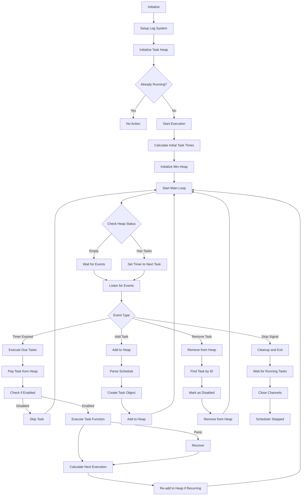

# Cron Job (Golang)

> Minimal scheduler for Golang supporting standard cron expressions, predefined descriptors, and custom intervals for easy scheduled task implementation in Go.<br>
> Originally designed for threat score decay calculation scheduling in [pardnchiu/go-ip-sentry](https://github.com/pardnchiu/go-ip-sentry).

[](https://github.com/pardnchiu/go-cron-job/blob/main/LICENSE)
[](https://github.com/pardnchiu/go-cron-job/releases)
[](https://github.com/pardnchiu/go-cron-job/blob/main/README.zh.md) 

## Three key features

- **Flexible Scheduling Support**: Complete support for standard cron expressions, predefined descriptors (@hourly, @daily, @weekly, etc.), and custom interval (@every) syntax
- **Concurrent Safe Execution**: Thread-safe task execution and management with panic recovery mechanism and dynamic task addition/removal functionality
- **High-Performance Architecture**: Min-heap based task scheduling algorithm with optimized memory usage, ensuring optimal performance in high-volume task scenarios

## Flow

<details>
<summary>Click to show</summary>



</details>

## Dependencies

- [`github.com/pardnchiu/go-logger`](https://github.com/pardnchiu/go-logger)

## How to use

### Installation
```bash
go get github.com/pardnchiu/go-cron
```

### Initialization
```go
package main

import (
  "fmt"
  "log"
  "time"
  
  cronJob "github.com/pardnchiu/go-cron"
)

func main() {
  // Create configuration
  config := cronJob.Config{
  Log: &cronJob.Log{
    Stdout: true,
  },
  Location: time.Local,
  }
  
  // Initialize cron scheduler
  scheduler, err := cronJob.New(config)
  if err != nil {
  log.Fatal(err)
  }
  
  // Add tasks with different schedules
  
  // Standard cron expression - every 5 minutes
  id1, err := scheduler.Add("*/5 * * * *", func() {
  fmt.Println("Task runs every 5 minutes")
  })
  
  // Predefined descriptor - hourly
  id2, err := scheduler.Add("@hourly", func() {
  fmt.Println("Hourly task executed")
  })
  
  // Custom interval - every 30 seconds
  id3, err := scheduler.Add("@every 30s", func() {
  fmt.Println("Task runs every 30 seconds")
  })
  
  if err != nil {
  log.Printf("Failed to add task: %v", err)
  }
  
  // Run for some time
  time.Sleep(10 * time.Minute)
  
  // Remove specific task
  scheduler.Remove(id1)
  
  // Stop scheduler and wait for completion
  ctx := scheduler.Stop()
  <-ctx.Done()
  
  fmt.Println("Scheduler stopped gracefully")
}
```

## Configuration

```go
type Config struct {
  Log      *Log           // Log configuration
  Location *time.Location // Timezone setting (default: time.Local)
}

type Log struct {
  Path      string // Log file path (default: ./logs/cron.log)
  Stdout    bool   // Output to stdout (default: false)
  MaxSize   int64  // Maximum log file size in bytes (default: 16MB)
  MaxBackup int    // Number of backup files to retain (default: 5)
  Type      string // Output format: "json" for slog standard, "text" for tree format (default: "text")
}
```

## Supported Schedule Formats

### Standard Cron Expressions
5-field format: `minute hour day month weekday`

```go
// Every minute
scheduler.Add("* * * * *", task)

// Daily at midnight
scheduler.Add("0 0 * * *", task)

// Weekdays at 9 AM
scheduler.Add("0 9 * * 1-5", task)

// Every 15 minutes
scheduler.Add("*/15 * * * *", task)

// First day of month at 6 AM
scheduler.Add("0 6 1 * *", task)
```

### Predefined Descriptors

```go
// January 1st at midnight
scheduler.Add("@yearly", task)    // or "@annually"

// First day of month at midnight
scheduler.Add("@monthly", task)

// Sunday at midnight
scheduler.Add("@weekly", task)

// Daily at midnight
scheduler.Add("@daily", task)     // or "@midnight"

// Every hour at minute 0
scheduler.Add("@hourly", task)
```

### Custom Intervals

```go
// Every 30 seconds
scheduler.Add("@every 30s", task)

// Every 5 minutes
scheduler.Add("@every 5m", task)

// Every 2 hours
scheduler.Add("@every 2h", task)

// Every 12 hours
scheduler.Add("@every 12h", task)
```

## Core Functions

### Scheduler Management

- **New** - Create new scheduler instance
  ```go
  scheduler, err := cronJob.New(config)
  ```
  - Initializes logging system with configurable output and rotation
  - Sets up task heap and communication channels
  - Automatically starts scheduling loop

- **Stop** - Gracefully stop scheduler
  ```go
  ctx := scheduler.Stop()
  <-ctx.Done() // Wait for all tasks to complete
  ```
  - Sends stop signal to main loop
  - Returns context that completes when all running tasks finish
  - Ensures clean shutdown without interrupting tasks

### Task Management

- **Add** - Schedule new task
  ```go
  taskID, err := scheduler.Add("0 */2 * * *", func() {
  // Task logic
  })
  ```
  - Parses schedule expression or descriptor
  - Generates unique task ID for management
  - Thread-safe addition during runtime

- **Remove** - Unschedule task
  ```go
  scheduler.Remove(taskID)
  ```
  - Removes task from scheduling queue
  - Safe to call regardless of scheduler state

## Execution Flow

1. Create scheduler instance using [`New`](instance.go)
2. Add tasks to schedule using [`Add`](add.go)
3. Scheduler automatically calculates next execution times
4. Tasks are triggered when execution time is reached
5. Remove unwanted tasks using [`Remove`](remove.go)
6. Gracefully shutdown scheduler using [`Stop`](instance.go)

## License

This project is licensed under the [MIT](https://github.com/pardnchiu/go-cron-job/blob/main/LICENSE) License.

## Author


<h4 style="padding-top: 0">Pardn Chiu</h4>

<a href="mailto:dev@pardn.io" target="_blank">
  
</a> <a href="https://linkedin.com/in/pardnchiu" target="_blank">
  
</a>

***

©️ 2025 [Pardn Chiu](https://pardn.io)