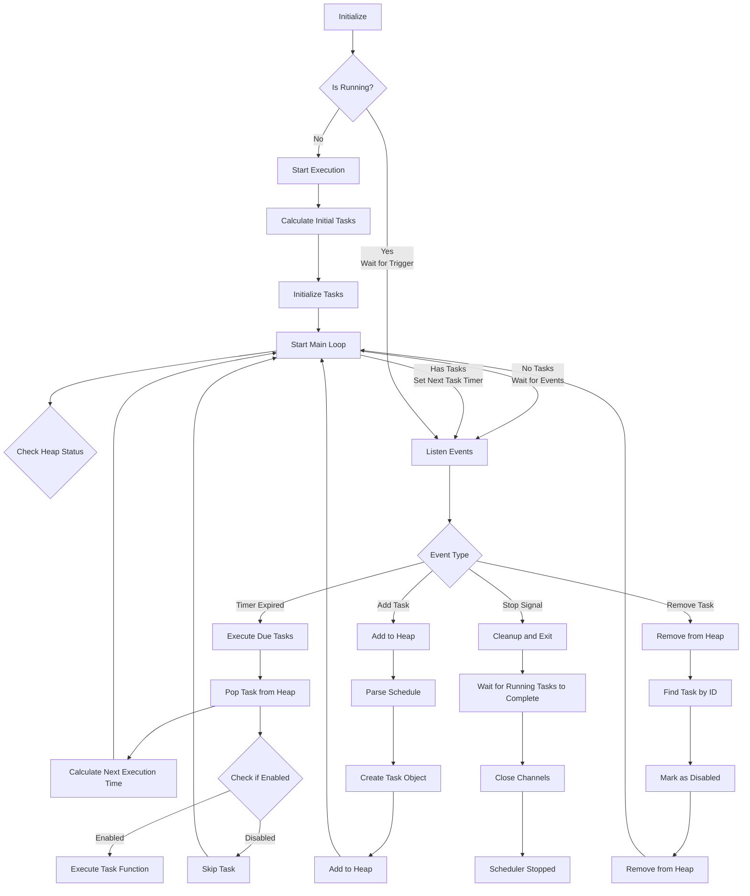
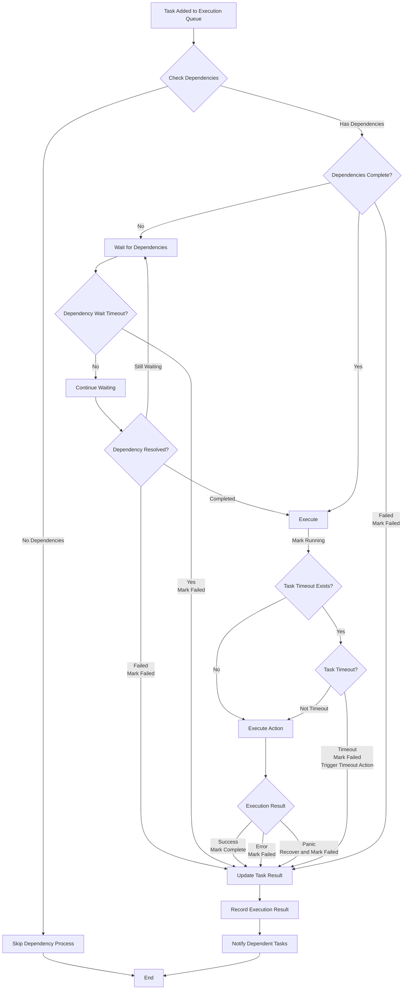

> [!NOTE]
> This README was translated by ChatGPT 4o
# Cron Scheduler

> Lightweight Golang scheduler supporting standard cron expressions, custom descriptors, custom intervals, and task dependencies. Easy scheduling with Go<br>
> Originally designed for the scheduling functionality used in threat score decay calculations for [pardnchiu/go-ip-sentry](https://github.com/pardnchiu/go-ip-sentry)

[](https://pkg.go.dev/github.com/pardnchiu/go-scheduler)
[](https://goreportcard.com/report/github.com/pardnchiu/go-scheduler)
[](https://app.codecov.io/github/pardnchiu/go-scheduler)
[](https://github.com/pardnchiu/go-scheduler/releases)
[](LICENSE)<br>
[](README.md)
[](README.zh.md)

- [Core Features](#core-features)
  - [Flexible Syntax](#flexible-syntax)
  - [Task Dependencies](#task-dependencies)
  - [Efficient Architecture](#efficient-architecture)
- [Flowchart](#flowchart)
- [Dependencies](#dependencies)
- [Usage](#usage)
  - [Installation](#installation)
  - [Initialization](#initialization)
    - [Basic Usage](#basic-usage)
    - [Task Dependencies](#task-dependencies-1)
- [Configuration](#configuration)
- [Supported Formats](#supported-formats)
  - [Standard](#standard)
  - [Custom](#custom)
- [Available Functions](#available-functions)
  - [Scheduler Management](#scheduler-management)
  - [Task Management](#task-management)
- [Task Dependencies](#task-dependencies-2)
  - [Basic Usage](#basic-usage-1)
  - [Dependency Examples](#dependency-examples)
  - [Task Status](#task-status)
- [Timeout Mechanism](#timeout-mechanism)
  - [Features](#features)
- [Upcoming Features](#upcoming-features)
  - [Enhanced Task Dependencies](#enhanced-task-dependencies)
  - [Task Completion Trigger Refactor](#task-completion-trigger-refactor)
- [License](#license)
- [Star](#star)
- [Author](#author)

## Core Features

### Flexible Syntax
Supports standard cron expressions, custom descriptors (`@hourly`, `@daily`, `@weekly`, etc.), and custom interval (`@every`) syntax. Zero learning curve - if you know cron expressions, you can use it.

### Task Dependencies
Supports prerequisite dependency tasks, multiple dependencies, dependency timeout control, and failure handling mechanisms.

### Efficient Architecture
Uses Golang standard library `heap`, focusing on core functionality. Min-heap based task scheduling with concurrent task execution and management, featuring panic recovery and dynamic task add/remove capabilities, ensuring optimal performance in high-volume task scenarios.

## Flowchart

<details>
<summary>Main Process</summary> 



</details>

<details>
<summary>Dependency Process</summary>



</details>

## Dependencies

- ~~[`github.com/pardnchiu/go-logger`](https://github.com/pardnchiu/go-logger)~~ (< v0.3.1)<br>
  For performance and stability, non-standard library packages are deprecated from `v0.3.1`, now using `log/slog`

## Usage

### Installation

> [!NOTE]
> Latest commit may change, recommended to use tagged versions<br>
> Commits containing only documentation updates or non-functional changes will be rebased later

```bash
go get github.com/pardnchiu/go-scheduler@[VERSION]

git clone --depth 1 --branch [VERSION] https://github.com/pardnchiu/go-scheduler.git
```

### Initialization

#### Basic Usage
```go
package main

import (
  "fmt"
  "log"
  "time"
  
  cron "github.com/pardnchiu/go-scheduler"
)

func main() {
  // Initialize (optional configuration)
  scheduler, err := cron.New(cron.Config{
    Location: time.Local,
  })
  if err != nil {
    log.Fatal(err)
  }
  
  // Start scheduler
  scheduler.Start()
  
  // Add tasks
  id1, _ := scheduler.Add("@daily", func() {
    fmt.Println("Daily execution")
  }, "Backup task")
  
  id2, _ := scheduler.Add("@every 5m", func() {
    fmt.Println("Execute every 5 minutes")
  })
  
  // View task list
  tasks := scheduler.List()
  fmt.Printf("Currently have %d tasks\n", len(tasks))
  
  // Remove specific task
  scheduler.Remove(id1)
  
  // Remove all tasks
  scheduler.RemoveAll()
  
  // Graceful shutdown
  ctx := scheduler.Stop()
  <-ctx.Done()
}
```

#### Task Dependencies
```go
package main

import (
  "fmt"
  "log"
  "time"
  
  cron "github.com/pardnchiu/go-scheduler"
)

func main() {
  scheduler, err := cron.New(cron.Config{})
  if err != nil {
    log.Fatal(err)
  }
  
  scheduler.Start()
  defer func() {
    ctx := scheduler.Stop()
    <-ctx.Done()
  }()
  
  // Task A: Data preparation
  taskA, _ := scheduler.Add("0 1 * * *", func() error {
    fmt.Println("Preparing data...")
    time.Sleep(2 * time.Second)
    return nil
  }, "Data preparation")
  
  // Task B: Data processing  
  taskB, _ := scheduler.Add("0 2 * * *", func() error {
    fmt.Println("Processing data...")
    time.Sleep(3 * time.Second)
    return nil
  }, "Data processing")
  
  // Task C: Report generation (depends on A and B)
  taskC, _ := scheduler.Add("0 3 * * *", func() error {
    fmt.Println("Generating report...")
    time.Sleep(1 * time.Second)
    return nil
  }, "Report generation", []Wait{{ID: taskA}, {ID: taskB}})
  
  // Task D: Email sending (depends on C)
  _, _ = scheduler.Add("0 4 * * *", func() error {
    fmt.Println("Sending email...")
    return nil
  }, "Email notification", []Wait{{ID: taskC}})
  
  time.Sleep(10 * time.Second)
}
```

## Configuration
```go
type Config struct {
  Location *time.Location // Timezone setting (default: time.Local)
}
```

## Supported Formats

### Standard
> 5-field format: `minute hour day month weekday`<br>
> Supports range syntax `1-5` and `1,3,5`

```go
// Every minute
scheduler.Add("* * * * *", task)

// Daily at midnight
scheduler.Add("0 0 * * *", task)

// Every 15 minutes
scheduler.Add("*/15 * * * *", task)

// First day of month at 6 AM
scheduler.Add("0 6 1 * *", task)

// Monday to Wednesday, and Friday
scheduler.Add("0 0 * * 1-3,5", task)
```

### Custom
```go
// January 1st at midnight
scheduler.Add("@yearly", task)

// First day of month at midnight
scheduler.Add("@monthly", task)

// Every Sunday at midnight
scheduler.Add("@weekly", task)

// Daily at midnight
scheduler.Add("@daily", task)

// Every hour on the hour
scheduler.Add("@hourly", task)

// Every 30 seconds (minimum interval: 30 seconds)
scheduler.Add("@every 30s", task)

// Every 5 minutes
scheduler.Add("@every 5m", task)

// Every 2 hours
scheduler.Add("@every 2h", task)

// Every 12 hours
scheduler.Add("@every 12h", task)
```

## Available Functions

### Scheduler Management

- `New()` - Create new scheduler instance
  ```go
  scheduler, err := cron.New(config)
  ```
  - Sets up task heap and communication channels

- `Start()` - Start scheduler instance
  ```go
  scheduler.Start()
  ```
  - Starts the scheduling loop

- `Stop()` - Stop scheduler
  ```go
  ctx := scheduler.Stop()
  <-ctx.Done() // Wait for all tasks to complete
  ```
  - Sends stop signal to main loop
  - Returns context that completes when all running tasks finish
  - Ensures graceful shutdown without interrupting tasks

### Task Management

- `Add()` - Add scheduled task
  ```go
  // Basic usage (no return value)
  taskID, err := scheduler.Add("0 */2 * * *", func() {
    // Task logic
  })

  // Task with error return (supports dependencies)
  taskID, err := scheduler.Add("@daily", func() error {
    // Task logic
    return nil
  }, "Backup task")

  // Task with timeout control
  taskID, err := scheduler.Add("@hourly", func() error {
    // Long-running task
    time.Sleep(10 * time.Second)
    return nil
  }, "Data processing", 5*time.Second)

  // Task with timeout callback
  taskID, err := scheduler.Add("@daily", func() error {
    // Potentially timeout-prone task
    return heavyProcessing()
  }, "Critical backup", 30*time.Second, func() {
    log.Println("Backup task timed out, please check system status")
  })

  // Task with dependencies
  taskID, err := scheduler.Add("@daily", func() error {
    // Task that depends on other tasks
    return processData()
  }, "Data processing", []Wait{{ID: taskA}, {ID: taskB}})

  // Task with dependencies and timeout
  taskID, err := scheduler.Add("@daily", func() error {
    return generateReport()
  }, "Report generation", []Wait{
    {ID: taskA, Delay: 30 * time.Second},
    {ID: taskB, Delay: 45 * time.Second},
  })
  ```
  - Parses schedule syntax
  - Generates unique task ID for management
  - Supports variadic parameter configuration
    - `string`: Task description
    - `time.Duration`: Task execution timeout
    - `func()`: Callback function triggered on timeout
    - `[]Wait`: Dependency task configuration (recommended format)
    - `[]int64`: Dependency task ID list (will be removed after v2.0)
  - Supports two action function types
    - `func()`: No error return, doesn't support dependencies
    - `func() error`: Has error return, supports dependencies

- `Remove()` - Cancel task schedule
  ```go
  scheduler.Remove(taskID)
  ```
  - Removes task from scheduling queue
  - Safe to call regardless of scheduler state

- `RemoveAll()` - Remove all tasks
  ```go
  scheduler.RemoveAll()
  ```
  - Immediately removes all scheduled tasks
  - Doesn't affect currently running tasks

- `List()` - Get task list
  ```go
  tasks := scheduler.List()
  ```

## Task Dependencies 

### Basic Usage
- No dependencies: Execute directly
- Has dependencies: Execute through worker pool and dependency manager
  - Single dependency: Task B executes after Task A completes
  - Multiple dependencies: Task C waits for both Task A and B to complete
  - Dependency task timeout: Maximum time to wait for dependency completion (default 1 minute)

### Dependency Examples

**Failure handling strategies**:
```go
// Skip: Continue execution when dependency fails
taskC, _ := scheduler.Add("0 3 * * *", func() error {
    fmt.Println("Generating report...")
    return nil
}, "Report generation", []Wait{
    {ID: taskA, State: Skip},  // Skip when taskA fails
    {ID: taskB, State: Stop},  // Stop when taskB fails (default)
})
```

**Custom timeout**:
```go
// Set independent wait time for each dependency
taskC, _ := scheduler.Add("0 3 * * *", func() error {
    fmt.Println("Generating report...")
    return nil
}, "Report generation", []Wait{
    {ID: taskA, Delay: 30 * time.Second},  // Wait 30 seconds
    {ID: taskB, Delay: 45 * time.Second},  // Wait 45 seconds
})
```

**Combined usage**:
```go
// Combine failure strategies with custom timeout
taskC, _ := scheduler.Add("0 3 * * *", func() error {
    fmt.Println("Generating report...")
    return nil
}, "Report generation", []Wait{
    {ID: taskA, Delay: 30 * time.Second, State: Skip},
    {ID: taskB, Delay: 45 * time.Second, State: Stop},
})
```

### Task Status
```go
const (
    TaskPending     // Waiting
    TaskRunning     // Running 
    TaskCompleted   // Completed
    TaskFailed      // Failed / Timeout
)
```

## Timeout Mechanism
When execution time exceeds the set `Delay`:
- Interrupts task execution
- Triggers `OnDelay` function (if set)
- Logs timeout
- Continues with next schedule

### Features
- Timeout implemented using `context.WithTimeout`
- Timeout doesn't affect other task execution
- If action completes before timeout, timeout won't trigger

## Upcoming Features

### Enhanced Task Dependencies

- Status callbacks: Add `OnTimeout` and `OnFailed` callback functions for monitoring and responding to dependency task exception states

### Task Completion Trigger Refactor

- Event-driven: Replace current polling with fully `channel`-based approach to reduce CPU usage
- Dependency awakening: Implement active notification mechanism when dependency tasks complete, eliminating ineffective polling checks

## License

This project is licensed under [MIT](LICENSE).

## Star

[](https://www.star-history.com/#pardnchiu/go-scheduler&Date)

## Author


<h4 style="padding-top: 0">邱敬幃 Pardn Chiu</h4>

<a href="mailto:dev@pardn.io" target="_blank">
  
</a> <a href="https://linkedin.com/in/pardnchiu" target="_blank">
  
</a>

***

©️ 2025 [邱敬幃 Pardn Chiu](https://pardn.io)