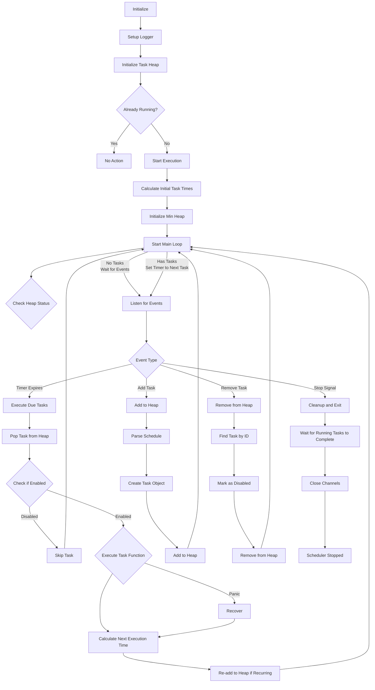

> [!Note]
> This content is translated by LLM. Original text can be found [here](README.zh.md)

# Cron Job Scheduler (Golang)

> Ultra-lightweight Golang scheduler supporting standard cron expressions, custom descriptors, and custom intervals. A minimalist scheduler for Go that makes scheduling effortless.<br>
> Originally designed for the scheduling functionality used in threat score decay calculations for [pardnchiu/go-ip-sentry](https://github.com/pardnchiu/go-ip-sentry).

[](LICENSE)
[](https://github.com/pardnchiu/go-cron/releases)
[](README.zh.md) 

## Three Core Features

### Ultra-low Learning Cost
Zero learning curve - if you know how to write cron expressions, you basically know how to use it

### Flexible Syntax
Supports standard cron expressions, custom descriptors (`@hourly`, `@daily`, `@weekly`, etc.) and custom interval (`@every`) syntax

### Efficient Architecture
Uses Go's standard library heap, focuses on core functionality, min-heap based task scheduling algorithm, concurrent task execution and management, with panic recovery mechanism and dynamic task add/remove capabilities, ensuring optimal performance in high-volume task scenarios

## Flow Chart

<details>
<summary>Click to view</summary>



</details>

## Dependencies

- [`github.com/pardnchiu/go-logger`](https://github.com/pardnchiu/go-logger): if you don't need this, just fork it and replace with your preferred solution.

## Usage

### Installation
```bash
go get github.com/pardnchiu/go-cron
```

### Initialization
```go
package main

import (
  "fmt"
  "log"
  "time"
  
  cron "github.com/pardnchiu/go-cron"
)

func main() {
  // Initialize (optional configuration)
  scheduler, err := cron.New(cron.Config{
    Log: &cron.Log{Stdout: true},
    Location: time.Local,
  })
  if err != nil {
    log.Fatal(err)
  }
  
  // Start scheduler
  scheduler.Start()
  
  // Add tasks
  id1, _ := scheduler.Add("@daily", func() {
    fmt.Println("Daily execution")
  }, "Backup task")
  
  id2, _ := scheduler.Add("@every 5m", func() {
    fmt.Println("Execute every 5 minutes")
  })
  
  // View task list
  tasks := scheduler.List()
  fmt.Printf("Currently have %d tasks\n", len(tasks))
  
  // Remove specific task
  scheduler.Remove(id1)
  
  // Remove all tasks
  scheduler.RemoveAll()
  
  // Graceful shutdown
  ctx := scheduler.Stop()
  <-ctx.Done()
}
```

## Configuration

```go
type Config struct {
  Log      *Log           // Logger configuration
  Location *time.Location // Timezone setting (default: time.Local)
}

type Log struct {
  Path      string // Log file path (default: ./logs/cron.log)
  Stdout    bool   // Output to stdout (default: false)
  MaxSize   int64  // Maximum log file size in bytes (default: 16MB)
  MaxBackup int    // Number of backup files to retain (default: 5)
  Type      string // Output format: "json" for slog standard, "text" for tree format (default: "text")
}
```

## Supported Formats

### Standard Cron
5-field format: `minute hour day month weekday`

```go
// Every minute
scheduler.Add("* * * * *", task)

// Daily at midnight
scheduler.Add("0 0 * * *", task)

// Weekdays at 9 AM
scheduler.Add("0 9 * * 1-5", task)

// Every 15 minutes
scheduler.Add("*/15 * * * *", task)

// First day of month at 6 AM
scheduler.Add("0 6 1 * *", task)
```

### Custom Descriptors

```go
// January 1st at midnight
scheduler.Add("@yearly", task)

// First day of month at midnight
scheduler.Add("@monthly", task)

// Every Sunday at midnight
scheduler.Add("@weekly", task)

// Daily at midnight
scheduler.Add("@daily", task)

// Every hour on the hour
scheduler.Add("@hourly", task)

// Every 30 seconds
scheduler.Add("@every 30s", task)

// Every 5 minutes
scheduler.Add("@every 5m", task)

// Every 2 hours
scheduler.Add("@every 2h", task)

// Every 12 hours
scheduler.Add("@every 12h", task)
```

## Available Functions

### Scheduler Management

- **New** - Create new scheduler instance
  ```go
  scheduler, err := cron.New(config)
  ```
  - Sets up task heap and communication channels

- **Start** - Start scheduler instance
  ```go
  scheduler.Start()
  ```
  - Starts scheduling loop

- **Stop** - Gracefully stop scheduler
  ```go
  ctx := scheduler.Stop()
  <-ctx.Done() // Wait for all tasks to complete
  ```
  - Sends stop signal to main loop
  - Returns context that completes when all running tasks finish
  - Ensures graceful shutdown without interrupting tasks

### Task Management

- **Add** - Add scheduled task
  ```go
  // Basic usage
  taskID, err := scheduler.Add("0 */2 * * *", func() {
    // Task logic
  })

  // Task with description
  taskID, err := scheduler.Add("@daily", func() {
    // Task logic
  }, "Backup task")

  // Task with timeout control
  taskID, err := scheduler.Add("@hourly", func() {
    // Long-running task
    time.Sleep(10 * time.Second)
  }, "Data processing", 5*time.Second)

  // Task with timeout callback
  taskID, err := scheduler.Add("@daily", func() {
    // Potentially timeout-prone task
    heavyProcessing()
  }, "Critical backup", 30*time.Second, func() {
    log.Println("Backup task timed out, please check system status")
  })
  ```
  - Parses schedule syntax
  - Generates unique task ID for management
  - Supports variadic parameter configuration:
    - `string`: Task description
    - `time.Duration`: Task execution timeout
    - `func()`: Callback function triggered on timeout

- **Remove** - Cancel task schedule
  ```go
  scheduler.Remove(taskID)
  ```
  - Removes task from scheduling queue
  - Safe to call regardless of scheduler state

- **RemoveAll** - Remove all tasks
  ```go
  scheduler.RemoveAll()
  ```
  - Immediately removes all scheduled tasks
  - Does not affect currently running tasks

- **List** - Get task list
  ```go
  tasks := scheduler.List()
  ```

## Timeout Mechanism
When execution time exceeds the configured `Delay`:
- Interrupts task execution
- Triggers `OnDelay` function (if configured)
- Logs timeout event
- Continues with next scheduled task

### Features
- Timeout implemented using `context.WithTimeout`
- Timeout does not affect execution of other tasks
- If action completes before timeout, timeout is not triggered

## Upcoming Features
- Task dependency management similar to [php-async](https://github.com/pardnchiu/php-async)
  - Pre-dependencies: Task B executes after Task A completes
  - Post-dependencies: Task B executes before Task A starts
  - Multiple dependencies: Task C waits for both Tasks A and B to complete before executing

## License

This project is licensed under the [MIT](LICENSE) License.

## Author


<h4 style="padding-top: 0">邱敬幃 Pardn Chiu</h4>

<a href="mailto:dev@pardn.io" target="_blank">
  
</a> <a href="https://linkedin.com/in/pardnchiu" target="_blank">
  
</a>

***

©️ 2025 [邱敬幃 Pardn Chiu](https://pardn.io)