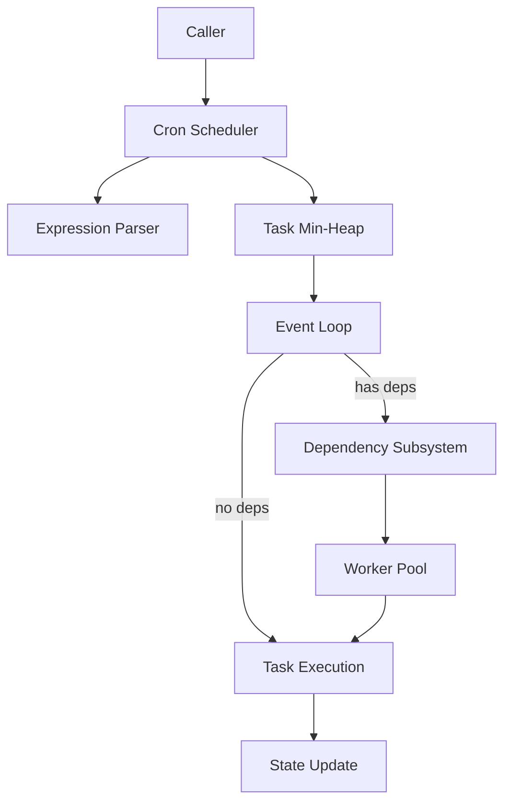

> [!NOTE]
> This README was generated by [SKILL](https://github.com/agenvoy/skill-readme-generate), get the ZH version from [here](./doc/README.zh.md).

***

<strong>SCHEDULE TASKS WITH DEPENDENCIES, TIMEOUTS, AND CRON EXPRESSIONS</strong>

 

***

> A Go scheduling library with task dependency chains, execution timeouts, and cron expressions

## Table of Contents

- [Features](#features)
- [Architecture](#architecture)
- [License](#license)
- [Author](#author)

## Features

> `go get github.com/pardnchiu/go-scheduler@latest` · [Documentation](./doc/doc.md)

- **Task Dependency Chains** — Declare prerequisites with `[]Wait` and choose Stop or Skip when a prerequisite fails.
- **Timeouts and Callbacks** — Cap each task's execution time; a timeout fires a callback and marks the task failed.
- **Cron, Descriptors, and Intervals** — Mix 5-field cron, descriptors such as `@daily`, and `@every` intervals.
- **Min-Heap Event Loop** — A min-heap tracks next fire times, so tasks can be added or removed while running.
- **Graceful Shutdown** — `Stop` returns a context that completes only after in-flight tasks finish.

## Architecture

> [Full Architecture](./doc/architecture.md)

```mermaid
graph TB
    App[Caller] --> Cron[Cron Scheduler]
    Cron --> Parser[Expression Parser]
    Cron --> Heap[Task Min-Heap]
    Heap --> Loop[Event Loop]
    Loop -->|no deps| Runner[Task Execution]
    Loop -->|has deps| Depend[Dependency Subsystem]
    Depend --> Workers[Worker Pool]
    Workers --> Runner
    Runner --> State[State Update]
```

## License

This project is licensed under the [MIT LICENSE](LICENSE).

## Author

Just [open an issue](https://github.com/pardnchiu/go-scheduler/issues/new) to share an idea.

***

©️ 2025 [邱敬幃 Pardn Chiu](https://www.linkedin.com/in/pardnchiu)
