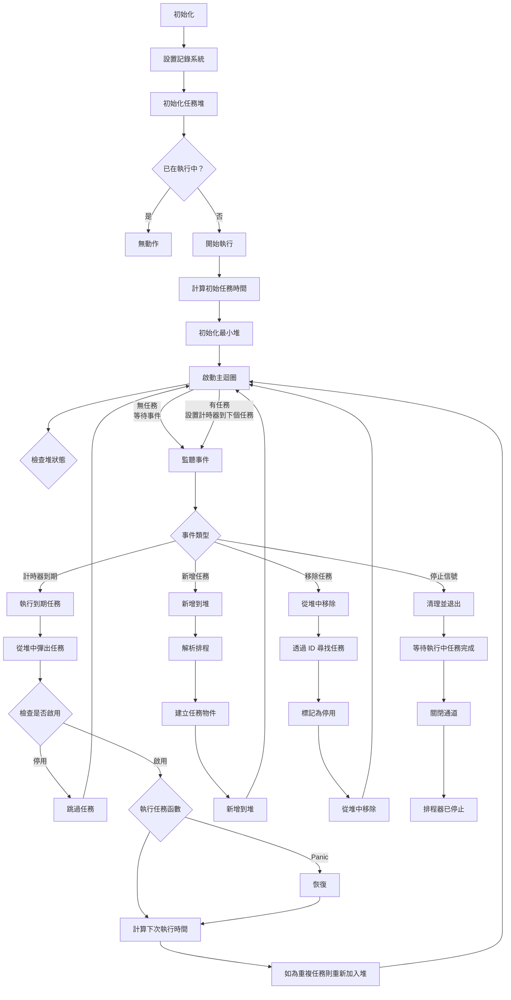

# Cron 任務排程 (Golang)

> 極致輕量的 Golang 排程器，支援標準 cron 表達式、自定義描述符和自訂間隔的 Golang 最小化排程器，輕鬆使用 Go 撰寫排程。<br>
> 原本是設計給 [pardnchiu/go-ip-sentry](https://github.com/pardnchiu/go-ip-sentry) 威脅分數衰退計算所使用到的排程功能。

[](LICENSE)
[](https://github.com/pardnchiu/go-cron/releases)
[](README.md) 

## 三大核心特色

### 超低學期成本
使用 Go 標準庫的 heap，專注核心功能，記憶體使用極低，零學習成本，只要會寫 cron 表達式就基本會使用

### 靈活語法
支援標準 cron 表達式、自定義描述符（`@hourly`、`@daily`、`@weekly` 等）和自訂間隔（`@every`）語法

### 高效架構
基於最小堆的任務排程演算法，併發的任務執行和管理，具有 panic 恢復機制和動態任務新增/移除功能，並確保在大量任務場景中的最佳效能

## 流程圖

<details>
<summary>點擊查看</summary>



</details>

## 依賴套件

- [`github.com/pardnchiu/go-logger`](https://github.com/pardnchiu/go-logger): 如果你不需要，你可以 fork 然後使用你熟悉的取代.

## 使用方法

### 安裝
```bash
go get github.com/pardnchiu/go-cron
```

### 初始化
```go
package main

import (
  "fmt"
  "log"
  "time"
  
  cron "github.com/pardnchiu/go-cron"
)

func main() {
  // 初始化（可選配置）
  scheduler, err := cron.New(cron.Config{
    Log: &cron.Log{Stdout: true},
    Location: time.Local,
  })
  if err != nil {
    log.Fatal(err)
  }
  
  // 啟動排程器
  scheduler.Start()
  
  // 添加任務
  id1, _ := scheduler.Add("@daily", func() {
    fmt.Println("每日執行")
  }, "備份任務")
  
  id2, _ := scheduler.Add("@every 5m", func() {
    fmt.Println("每 5 分鐘執行")
  })
  
  // 查看任務列表
  tasks := scheduler.List()
  fmt.Printf("目前有 %d 個任務\n", len(tasks))
  
  // 移除特定任務
  scheduler.Remove(id1)
  
  // 移除所有任務
  scheduler.RemoveAll()
  
  // 優雅停止
  ctx := scheduler.Stop()
  <-ctx.Done()
}
```

## 配置介紹

```go
type Config struct {
  Log      *Log           // 記錄配置
  Location *time.Location // 時區設定（預設：time.Local）
}

type Log struct {
  Path      string // 記錄檔路徑（預設：./logs/cron.log）
  Stdout    bool   // 輸出到標準輸出（預設：false）
  MaxSize   int64  // 記錄檔最大大小（位元組）（預設：16MB）
  MaxBackup int    // 保留的備份檔案數量（預設：5）
  Type      string // 輸出格式："json" 為 slog 標準，"text" 為樹狀格式（預設："text"）
}
```

## 支援格式

### 標準 Cron
5 欄位格式：`分鐘 小時 日 月 星期`

```go
// 每分鐘
scheduler.Add("* * * * *", task)

// 每日午夜
scheduler.Add("0 0 * * *", task)

// 平日上午 9 點
scheduler.Add("0 9 * * 1-5", task)

// 每 15 分鐘
scheduler.Add("*/15 * * * *", task)

// 每月第一天上午 6 點
scheduler.Add("0 6 1 * *", task)
```

### 自定義

```go
// 1 月 1 日午夜
scheduler.Add("@yearly", task)

// 每月第一天午夜
scheduler.Add("@monthly", task)

// 每週日午夜
scheduler.Add("@weekly", task)

// 每日午夜
scheduler.Add("@daily", task)

// 每小時整點
scheduler.Add("@hourly", task)

// 每 30 秒
scheduler.Add("@every 30s", task)

// 每 5 分鐘
scheduler.Add("@every 5m", task)

// 每 2 小時
scheduler.Add("@every 2h", task)

// 每 12 小時
scheduler.Add("@every 12h", task)
```

## 可用函式

### 排程管理

- **New** - 建立新的排程實例
  ```go
  scheduler, err := cron.New(config)
  ```
  - 設置任務堆和通訊通道

- **Start** - 啟動排程實例
  ```go
  scheduler.Start()
  ```
  - 啟動排程迴圈

- **Stop** - 正常停止排程器
  ```go
  ctx := scheduler.Stop()
  <-ctx.Done() // 等待所有任務完成
  ```
  - 向主迴圈發送停止信號
  - 回傳在所有執行中任務完成時完成的 context
  - 確保不中斷任務的關閉

### 任務管理

- **Add** - 新增排程任務
  ```go
  taskID, err := scheduler.Add("0 */2 * * *", func() {
    // 任務邏輯
  })
  ```
  - 解析排程語法
  - 產生唯一的任務 ID 以便管理

- **Remove** - 取消任務排程
  ```go
  scheduler.Remove(taskID)
  ```
  - 從排程佇列中移除任務
  - 無論排程器狀態如何都可安全呼叫

- **RemoveAll** -  移除所有任務
  ```go
  scheduler.RemoveAll()
  ```
  - 立即移除所有排程任務
  - 不影響正在執行的任務

- **List** - 獲取任務列表
  ```go
  tasks := scheduler.List()
  ```

## 功能預告
- 導入如 [php-async](https://github.com/pardnchiu/php-async) 中的任務依賴關係管理
  - 前置依賴：任務 B 在任務 A 完成後執行
  - 後置依賴：任務 B 在任務 A 開始前執行
  - 多重依賴：任務 C 等待任務 A、B 全部完成後執行

## 授權條款

此專案採用 [MIT](LICENSE) 授權條款。

## 作者


<h4 style="padding-top: 0">邱敬幃 Pardn Chiu</h4>

<a href="mailto:dev@pardn.io" target="_blank">
  
</a> <a href="https://linkedin.com/in/pardnchiu" target="_blank">
  
</a>

***

©️ 2025 [邱敬幃 Pardn Chiu](https://pardn.io)