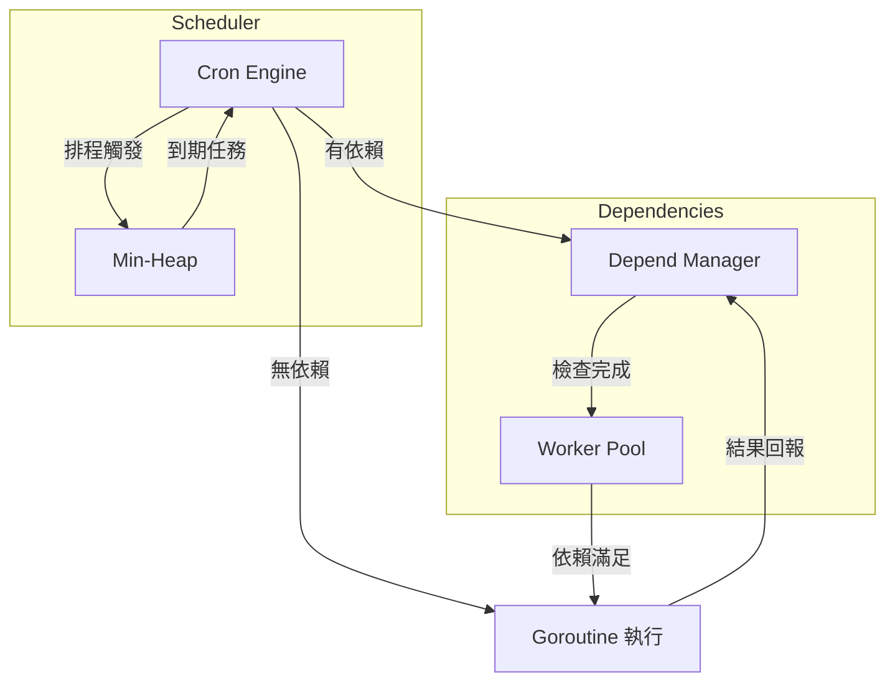

> [!NOTE]
> 此 README 由 [SKILL](https://github.com/pardnchiu/skill-readme-generate) 生成，英文版請參閱 [這裡](./README.md)。

# go-scheduler

[](https://pkg.go.dev/github.com/pardnchiu/go-scheduler)
[](https://goreportcard.com/report/github.com/pardnchiu/go-scheduler)
[](https://app.codecov.io/github/pardnchiu/go-scheduler)
[](LICENSE)
[](https://github.com/pardnchiu/go-scheduler/releases)

> 輕量級 Go 任務排程器，支援 Cron 語法、任務依賴鏈與失敗策略控制。

## 目錄

- [功能特點](#功能特點)
- [架構](#架構)
- [檔案結構](#檔案結構)
- [授權](#授權)
- [Author](#author)
- [Stars](#stars)

## 功能特點

> `go get github.com/pardnchiu/go-scheduler` · [完整文件](./doc.zh.md)

### Cron 排程與即時調度

支援標準五欄位 Cron 表達式與 `@every`、`@daily` 等預設描述符，透過 Min-Heap 排序觸發時間，確保下一個到期任務以最低開銷被精確喚醒。排程器運行期間可動態新增或移除任務，無需停機重啟。

### 任務依賴鏈與失敗策略

任務之間可宣告依賴關係，排程器在前置任務完成前自動阻擋後續任務執行。當前置任務失敗時提供 Skip 與 Stop 兩種策略：Skip 忽略失敗繼續執行，Stop 中止整條依賴鏈。每條依賴可設定獨立超時時間，避免因單一任務阻塞導致整體排程停滯。

### 併發安全與 Panic 恢復

每個任務在獨立 Goroutine 中執行，透過 Mutex 與 Channel 保證狀態讀寫的一致性。任務發生 Panic 時自動恢復，不影響排程器中其他任務的正常運行。支援以 Context 為基礎的超時控制，超時後觸發 onDelay Callback 供呼叫端處理善後邏輯。

## 架構



## 檔案結構

```
go-scheduler/
├── instance.go          # 排程器建立、啟動、停止與任務執行
├── add.go               # 任務新增與參數解析
├── remove.go            # 任務移除
├── task.go              # 任務列表查詢與 Heap 實作
├── schedule.go          # Cron 表達式與描述符解析
├── type.go              # 型別定義與常數
├── depend.go            # 依賴 Worker Pool 與任務執行
├── dependManager.go     # 依賴檢查、等待與狀態更新
├── cron_test.go         # 單元測試與效能測試
├── go.mod
└── LICENSE
```

## 授權

本專案採用 [MIT LICENSE](LICENSE)。

## Author


<h4 style="padding-top: 0">邱敬幃 Pardn Chiu</h4>

<a href="mailto:dev@pardn.io" target="_blank">

</a> <a href="https://linkedin.com/in/pardnchiu" target="_blank">

</a>

## Stars

[](https://www.star-history.com/#pardnchiu/go-scheduler&Date)

***

©️ 2025 [邱敬幃 Pardn Chiu](https://linkedin.com/in/pardnchiu)
