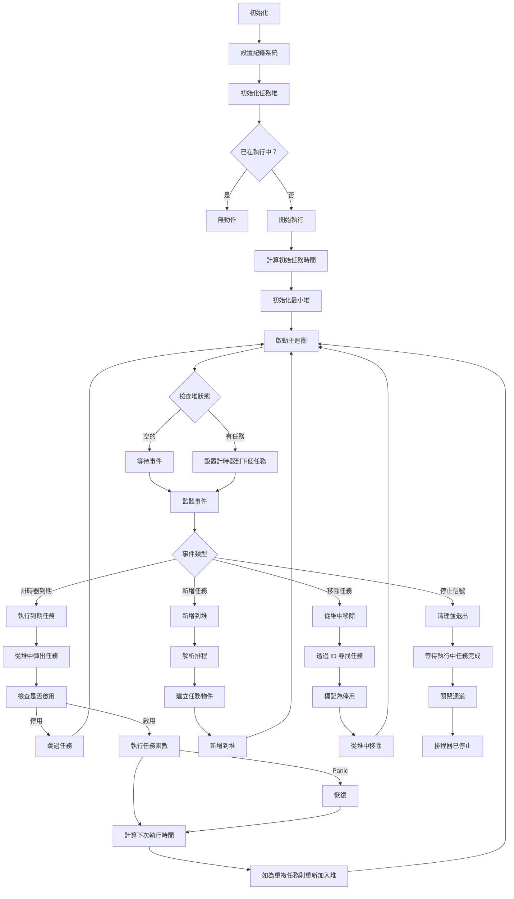

# Cron 任務排程 (Golang)

> 支援標準 cron 表達式、預定義描述符和自訂間隔的 Golang 最小化排程器，輕鬆實現 Go 中的定時任務。<br>
> 原本設計用於 [pardnchiu/go-ip-sentry](https://github.com/pardnchiu/go-ip-sentry) 威脅分數衰退計算所使用到的排程。

[](https://github.com/pardnchiu/go-cron-job/blob/main/LICENSE)
[](https://github.com/pardnchiu/go-cron-job/releases)
[](https://github.com/pardnchiu/go-cron-job/blob/main/README.md) 

## 三大核心特色

- **靈活排程支援**：完整支援標準 cron 表達式、預定義描述符（@hourly、@daily、@weekly 等）和自訂間隔（@every）語法
- **併發安全執行**：執行緒安全的任務執行和管理，具有 panic 恢復機制和動態任務新增/移除功能
- **高效能架構**：基於最小堆的任務排程演算法，優化記憶體使用，確保在大量任務場景中的最佳效能

## 執行流程

<details>
<summary>點擊查看</summary>



</details>

## 相依套件

- [`github.com/pardnchiu/go-logger`](https://github.com/pardnchiu/go-logger)

## 使用方法

### 安裝
```bash
go get github.com/pardnchiu/go-cron
```

### 初始化
```go
package main

import (
  "fmt"
  "log"
  "time"
  
  cronJob "github.com/pardnchiu/go-cron"
)

func main() {
  // 建立配置
  config := cronJob.Config{
  Log: &cronJob.Log{
    Stdout: true,
  },
  Location: time.Local,
  }
  
  // 初始化 cron 排程器
  scheduler, err := cronJob.New(config)
  if err != nil {
  log.Fatal(err)
  }
  
  // 使用不同排程新增任務
  
  // 標準 cron 表達式 - 每 5 分鐘
  id1, err := scheduler.Add("*/5 * * * *", func() {
  fmt.Println("任務每 5 分鐘執行一次")
  })
  
  // 預定義描述符 - 每小時
  id2, err := scheduler.Add("@hourly", func() {
  fmt.Println("每小時任務已執行")
  })
  
  // 自訂間隔 - 每 30 秒
  id3, err := scheduler.Add("@every 30s", func() {
  fmt.Println("任務每 30 秒執行一次")
  })
  
  if err != nil {
  log.Printf("新增任務失敗: %v", err)
  }
  
  // 執行一段時間
  time.Sleep(10 * time.Minute)
  
  // 移除特定任務
  scheduler.Remove(id1)
  
  // 停止排程器並等待完成
  ctx := scheduler.Stop()
  <-ctx.Done()
  
  fmt.Println("排程器已正常停止")
}
```

## 配置設定

```go
type Config struct {
  Log      *Log           // 記錄配置
  Location *time.Location // 時區設定（預設：time.Local）
}

type Log struct {
  Path      string // 記錄檔路徑（預設：./logs/cron.log）
  Stdout    bool   // 輸出到標準輸出（預設：false）
  MaxSize   int64  // 記錄檔最大大小（位元組）（預設：16MB）
  MaxBackup int    // 保留的備份檔案數量（預設：5）
  Type      string // 輸出格式："json" 為 slog 標準，"text" 為樹狀格式（預設："text"）
}
```

## 支援的排程格式

### 標準 Cron 表達式
5 欄位格式：`分鐘 小時 日 月 星期`

```go
// 每分鐘
scheduler.Add("* * * * *", task)

// 每日午夜
scheduler.Add("0 0 * * *", task)

// 平日上午 9 點
scheduler.Add("0 9 * * 1-5", task)

// 每 15 分鐘
scheduler.Add("*/15 * * * *", task)

// 每月第一天上午 6 點
scheduler.Add("0 6 1 * *", task)
```

### 預定義描述符

```go
// 1 月 1 日午夜
scheduler.Add("@yearly", task)    // 或 "@annually"

// 每月第一天午夜
scheduler.Add("@monthly", task)

// 每週日午夜
scheduler.Add("@weekly", task)

// 每日午夜
scheduler.Add("@daily", task)     // 或 "@midnight"

// 每小時整點
scheduler.Add("@hourly", task)
```

### 自訂間隔

```go
// 每 30 秒
scheduler.Add("@every 30s", task)

// 每 5 分鐘
scheduler.Add("@every 5m", task)

// 每 2 小時
scheduler.Add("@every 2h", task)

// 每 12 小時
scheduler.Add("@every 12h", task)
```

## 核心函數

### 排程器管理

- **New** - 建立新的排程器實例
  ```go
  scheduler, err := cronJob.New(config)
  ```
  - 初始化具有可配置輸出和輪替的記錄系統
  - 設置任務堆和通訊通道
  - 自動啟動排程迴圈

- **Stop** - 正常停止排程器
  ```go
  ctx := scheduler.Stop()
  <-ctx.Done() // 等待所有任務完成
  ```
  - 向主迴圈發送停止信號
  - 回傳在所有執行中任務完成時完成的 context
  - 確保乾淨的關閉而不中斷任務

### 任務管理

- **Add** - 排程新任務
  ```go
  taskID, err := scheduler.Add("0 */2 * * *", func() {
  // 任務邏輯
  })
  ```
  - 解析排程表達式或描述符
  - 產生唯一的任務 ID 以便管理
  - 執行時期執行緒安全的新增

- **Remove** - 取消排程任務
  ```go
  scheduler.Remove(taskID)
  ```
  - 從排程佇列中移除任務
  - 無論排程器狀態如何都可安全呼叫

## 執行流程

1. 使用 [`New`](instance.go) 建立排程器實例
2. 使用 [`Add`](add.go) 新增任務到排程
3. 排程器自動計算下次執行時間
4. 當執行時間到達時觸發任務
5. 使用 [`Remove`](remove.go) 移除不需要的任務
6. 使用 [`Stop`](instance.go) 正常關閉排程器

## 授權條款

此專案採用 [MIT](LICENSE) 授權條款。

## 作者


<h4 style="padding-top: 0">Pardn Chiu</h4>

<a href="mailto:dev@pardn.io" target="_blank">
  
</a> <a href="https://linkedin.com/in/pardnchiu" target="_blank">
  
</a>

***

©️ 2025 [Pardn Chiu](https://pardn.io)