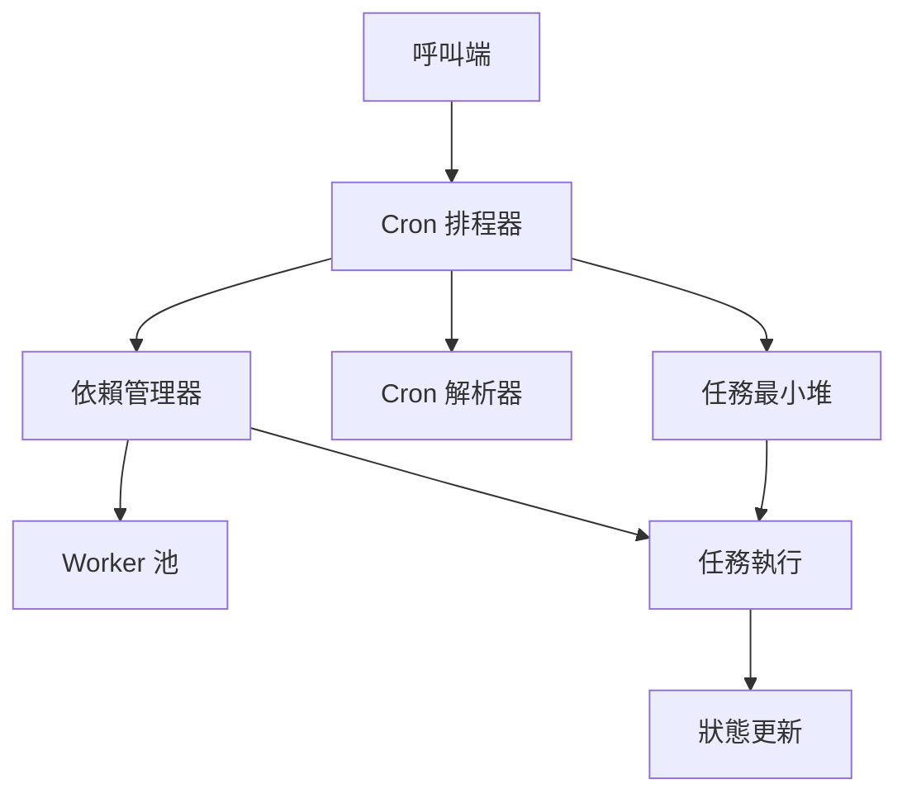

> [!NOTE]
> 此 README 由 [SKILL](https://github.com/agenvoy/skill-readme-generate) 生成，英文版請參閱 [這裡](../README.md)。

***

<strong>SCHEDULE TASKS WITH DEPENDENCIES, TIMEOUTS, AND CRON EXPRESSIONS</strong>

***

> Go 排程函式庫，具備任務依賴、超時控制與 Cron 表達式

## 目錄

- [功能特點](#功能特點)
- [架構](#架構)
- [授權](#授權)
- [Author](#author)

## 功能特點

> `go get github.com/pardnchiu/go-scheduler` · [完整文件](./doc.zh.md)

- **任務依賴鏈** — 透過 Wait 宣告前置任務，支援失敗時 Stop 或 Skip 策略。
- **超時與回呼** — 為每項任務設定執行時限，逾時觸發 onDelay 回呼並標記失敗。
- **Cron 與描述符** — 支援五欄位 Cron、@hourly/@daily 等描述符，以及 @every 間隔排程。
- **Heap 優先佇列** — 以最小堆管理下次觸發時間，動態新增與移除無需重啟。
- **優雅關閉** — Stop 回傳 context，等待進行中任務完成後再結束。

## 架構

> [完整架構](./architecture.zh.md)

## 授權

本專案採用 [MIT LICENSE](../LICENSE)。

## Author

<h4 style="padding-top: 0">邱敬幃 Pardn Chiu</h4>

<a href="mailto:dev@pardn.io">dev@pardn.io</a> 
<a href="https://linkedin.com/in/pardnchiu">https://linkedin.com/in/pardnchiu</a>

***

©️ 2025 [邱敬幃 Pardn Chiu](https://linkedin.com/in/pardnchiu)
