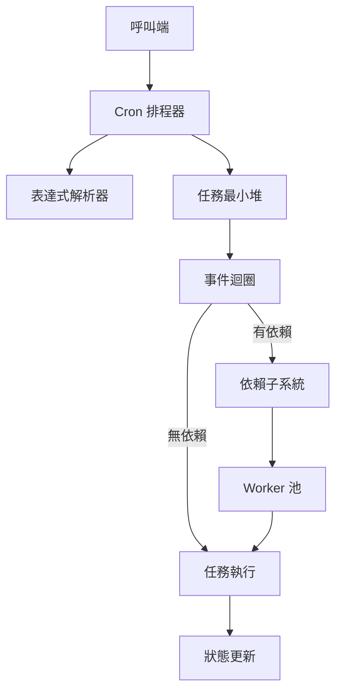

> [!NOTE]
> 此 README 由 [SKILL](https://github.com/agenvoy/skill-readme-generate) 生成，英文版請參閱 [這裡](../README.md)。

---

<strong>SCHEDULE TASKS WITH DEPENDENCIES, TIMEOUTS, AND CRON EXPRESSIONS</strong>

 

---

> Go 排程函式庫，具備任務依賴鏈、執行超時控制與 Cron 表達式

## 目錄

- [功能特點](#功能特點)
- [架構](#架構)
- [授權](#授權)
- [Author](#author)

## 功能特點

> `go get github.com/pardnchiu/go-scheduler@latest` · [完整文件](./doc.zh.md)

- **任務依賴鏈** — 以 `[]Wait` 宣告前置任務，前置失敗時可選擇 Stop 中止或 Skip 略過。
- **超時與回呼** — 為單一任務設定執行時限，逾時觸發回呼並將任務標記為失敗。
- **Cron、描述符與固定間隔** — 同時支援五欄位 Cron、`@daily` 等描述符與 `@every` 間隔排程。
- **最小堆事件迴圈** — 以最小堆追蹤下次觸發時間，執行中即可新增或移除任務而無需重啟。
- **優雅關閉** — `Stop` 回傳 context，於進行中任務結束後才完成。

## 架構

> [完整架構](./architecture.zh.md)

```mermaid
graph TB
    App[呼叫端] --> Cron[Cron 排程器]
    Cron --> Parser[表達式解析器]
    Cron --> Heap[任務最小堆]
    Heap --> Loop[事件迴圈]
    Loop -->|無依賴| Runner[任務執行]
    Loop -->|有依賴| Depend[依賴子系統]
    Depend --> Workers[Worker 池]
    Workers --> Runner
    Runner --> State[狀態更新]
```

## 授權

本專案採用 [MIT LICENSE](../LICENSE)。

## Author

Just [open an issue](https://github.com/pardnchiu/go-scheduler/issues/new) to share an idea.

---

©️ 2025 [邱敬幃 Pardn Chiu](https://www.linkedin.com/in/pardnchiu)
