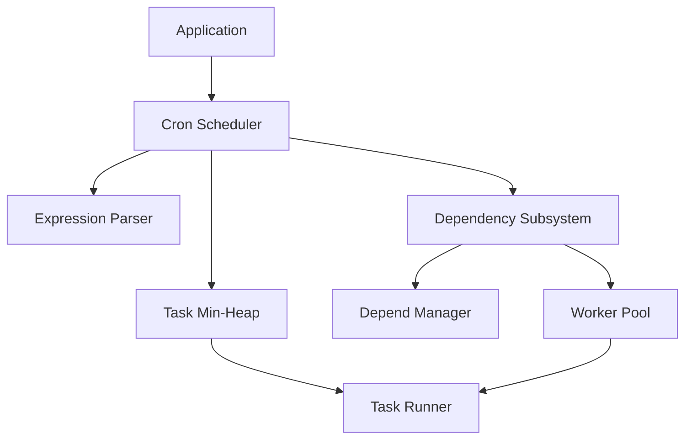
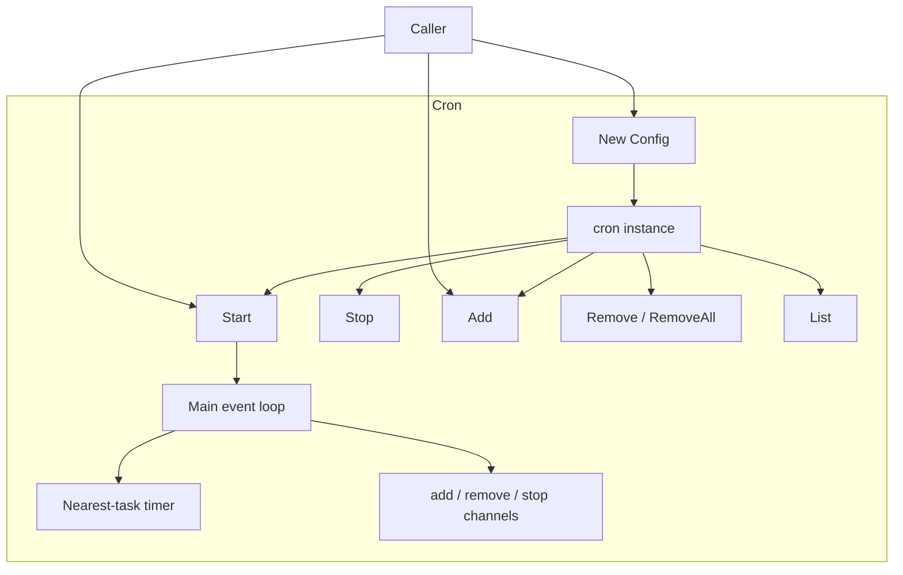
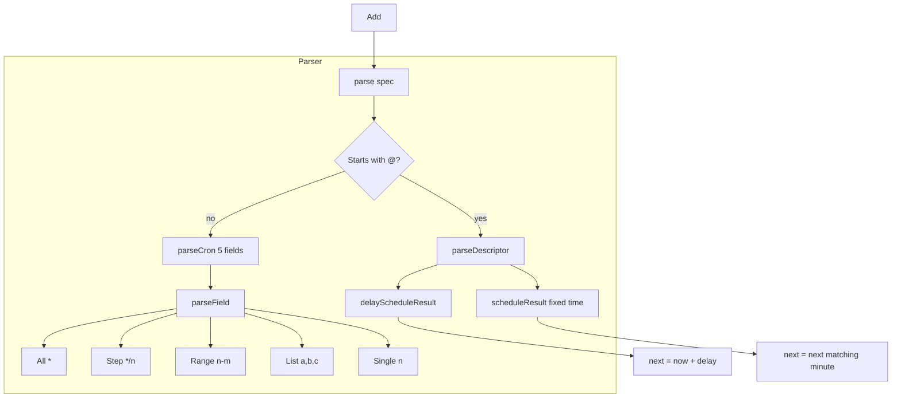
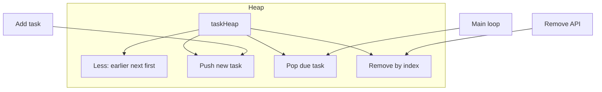
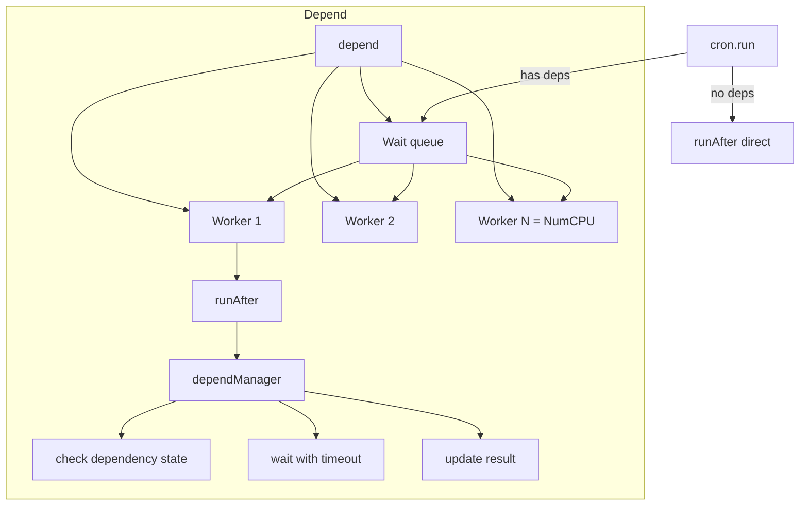
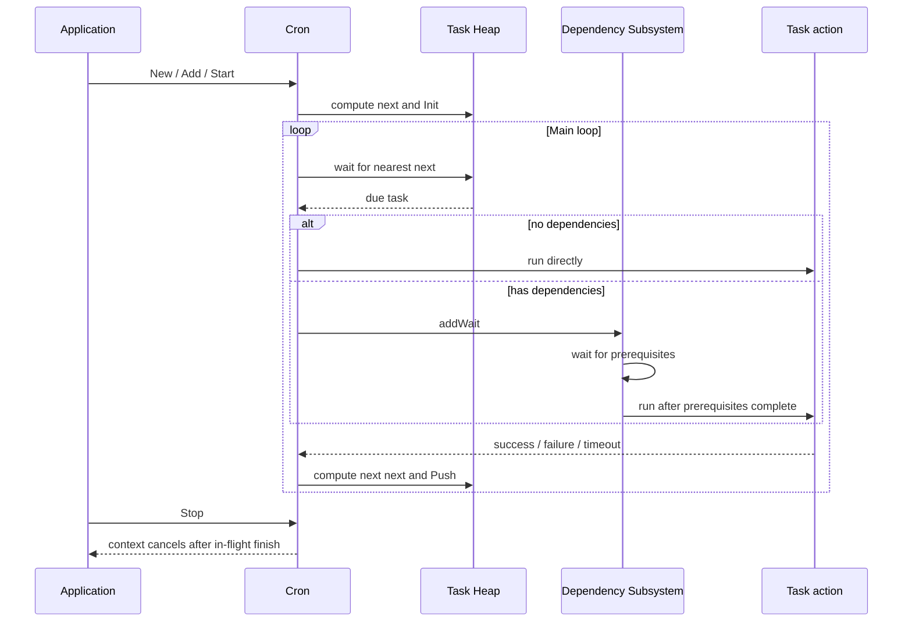
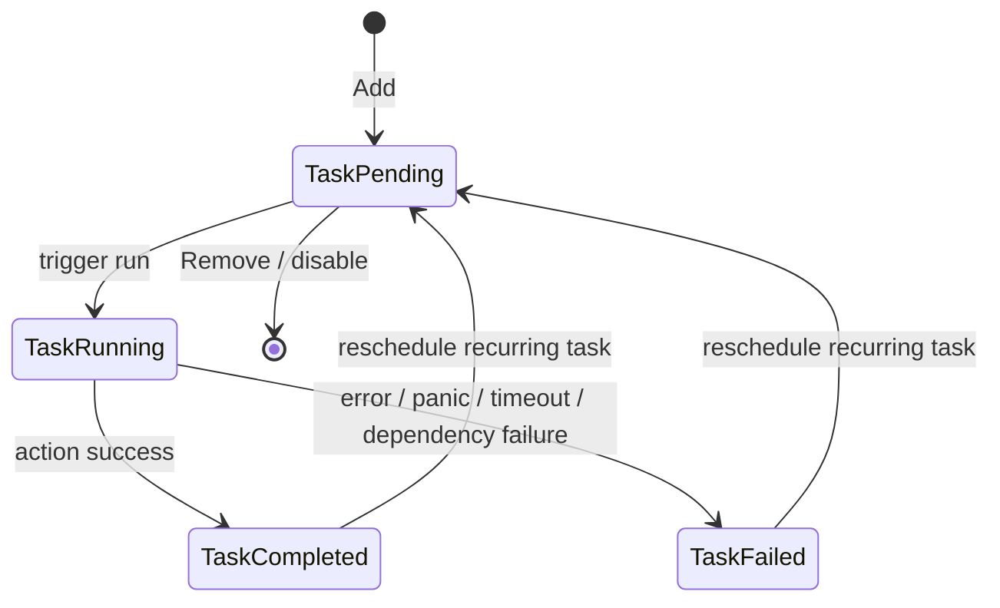

# go-scheduler - Architecture

> Back to [README](../README.md)

## Overview

## Module: Cron Scheduler

Owns lifecycle, task registration, and the time-driven main loop.

## Module: Expression Parser

Turns string specs into `schedule` implementations.

## Module: Task Min-Heap

Orders tasks by `next` so the main loop always handles the nearest due task.

## Module: Dependency Subsystem

When a task has `after` dependencies, the worker pool waits for prerequisites before running it.

## Data Flow

## State Machine

***

©️ 2025 [邱敬幃 Pardn Chiu](https://linkedin.com/in/pardnchiu)
