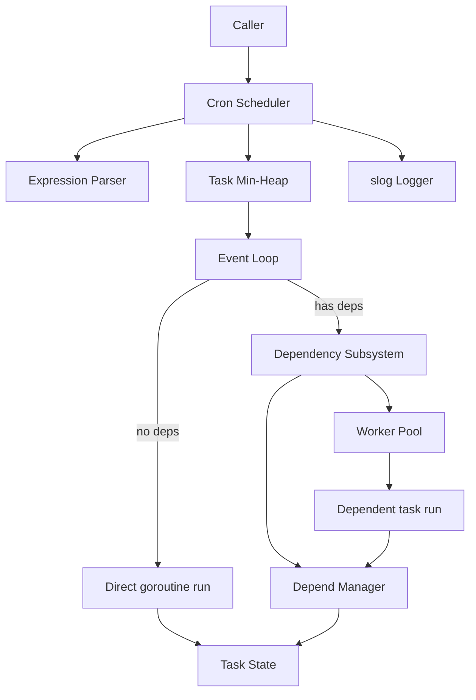
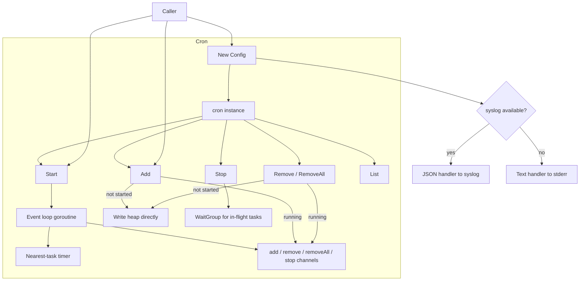
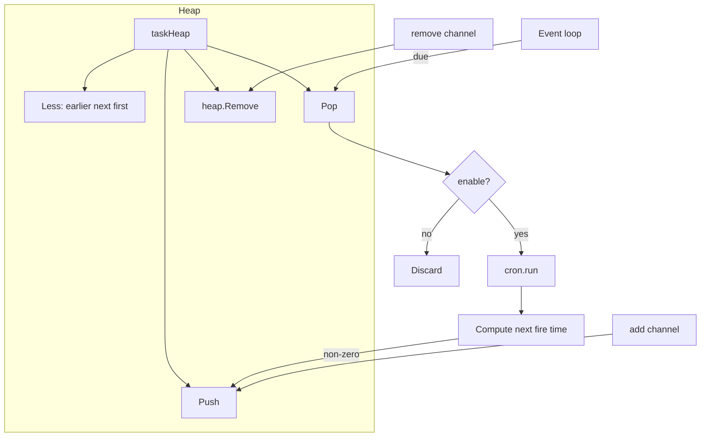
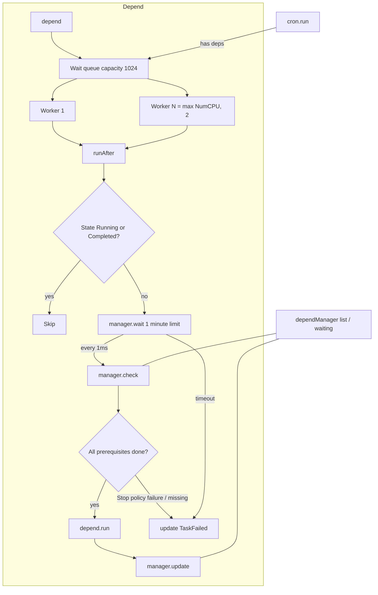
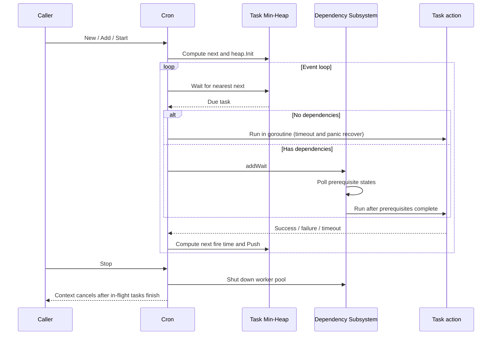
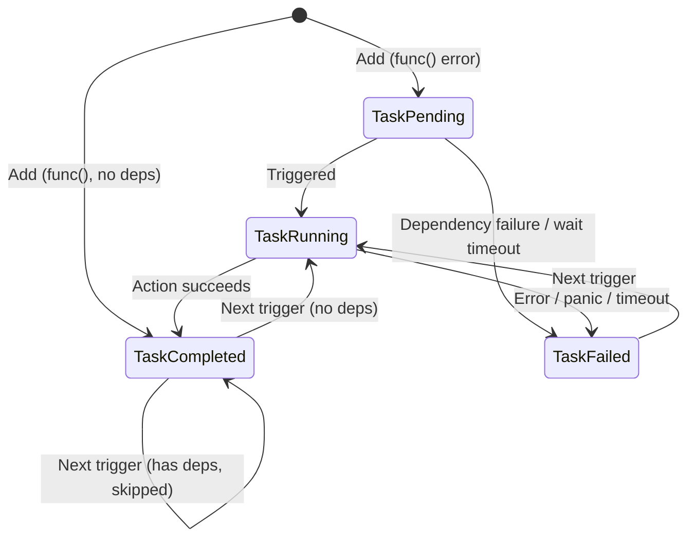

# go-scheduler - Architecture

> Back to [README](../README.md)

## Overview

```mermaid
graph TB
    App[Caller] --> Cron[Cron Scheduler]
    Cron --> Parser[Expression Parser]
    Cron --> Heap[Task Min-Heap]
    Cron --> Logger[slog Logger]
    Heap --> Loop[Event Loop]
    Loop -->|no deps| Runner[Direct goroutine run]
    Loop -->|has deps| Depend[Dependency Subsystem]
    Depend --> Manager[Depend Manager]
    Depend --> Workers[Worker Pool]
    Workers --> DepRunner[Dependent task run]
    Runner --> State[Task State]
    DepRunner --> Manager
    Manager --> State
```

## Module: Cron Scheduler

Owns the lifecycle, task registration, and the time-driven event loop.

```mermaid
graph TB
    subgraph Cron
        New[New Config] --> Instance[cron instance]
        Instance --> Start[Start]
        Instance --> Stop[Stop]
        Instance --> Add[Add]
        Instance --> Remove[Remove / RemoveAll]
        Instance --> List[List]
        Start --> Loop[Event loop goroutine]
        Loop --> Timer[Nearest-task timer]
        Loop --> Channels[add / remove / removeAll / stop channels]
        Add -->|running| Channels
        Remove -->|running| Channels
        Add -->|not started| HeapDirect[Write heap directly]
        Remove -->|not started| HeapDirect
        Stop --> WaitGroup[WaitGroup for in-flight tasks]
    end
    App[Caller] --> New
    App --> Start
    App --> Add
    New --> Syslog{syslog available?}
    Syslog -->|yes| JSON[JSON handler to syslog]
    Syslog -->|no| Text[Text handler to stderr]
```

## Module: Expression Parser

Turns string specs into `schedule` implementations.

```mermaid
graph TB
    subgraph Parser
        Parse[parse spec] --> IsDesc{Starts with @?}
        IsDesc -->|yes| Desc[parseDescriptor]
        IsDesc -->|no| Cron5[parseCron 5 fields]
        Desc --> Every{@every?}
        Every -->|yes and >= 30s| Delay[delayScheduleResult]
        Every -->|no| Fixed[scheduleResult fixed fields]
        Cron5 --> Field[parseField]
        Field --> All[* all]
        Field --> Step[*/n step]
        Field --> List[a,b list parseList]
        Field --> Range[n-m range parseRange]
        Field --> Value[n single]
        List --> Range
        Field --> Result[scheduleResult]
    end
    Add[Add] --> Parse
    Delay --> Next1[next = now + delay]
    Fixed --> Next2[Step minute by minute until all 5 fields match]
    Result --> Next2
```

## Module: Task Min-Heap

Orders tasks by `next` so the event loop always handles the nearest due task first.

```mermaid
graph TB
    subgraph Heap
        H[taskHeap] --> Less[Less: earlier next first]
        H --> Push[Push]
        H --> Pop[Pop]
        H --> Remove[heap.Remove]
    end
    Loop[Event loop] -->|due| Pop
    Pop --> Enabled{enable?}
    Enabled -->|no| Drop[Discard]
    Enabled -->|yes| Run[cron.run]
    Run --> Reschedule[Compute next fire time]
    Reschedule -->|non-zero| Push
    AddCh[add channel] --> Push
    RemoveCh[remove channel] --> Remove
```

## Module: Dependency Subsystem

Tasks with dependencies enter a queue; the worker pool polls prerequisite states before running them.

```mermaid
graph TB
    subgraph Depend
        D[depend] --> Queue[Wait queue capacity 1024]
        Queue --> W1[Worker 1]
        Queue --> Wn[Worker N = max NumCPU, 2]
        W1 --> RunAfter[runAfter]
        Wn --> RunAfter
        RunAfter --> Skip{State Running or Completed?}
        Skip -->|yes| Ignore[Skip]
        Skip -->|no| WaitDeps[manager.wait 1 minute limit]
        WaitDeps -->|every 1ms| Check[manager.check]
        Check --> Done{All prerequisites done?}
        Done -->|yes| Exec[depend.run]
        Done -->|Stop policy failure / missing| Fail[update TaskFailed]
        WaitDeps -->|timeout| Fail
        Exec --> Update[manager.update]
    end
    CronRun[cron.run] -->|has deps| Queue
    Manager[dependManager list / waiting] --- Check
    Manager --- Update
```

## Data Flow

```mermaid
sequenceDiagram
    participant App as Caller
    participant Cron as Cron
    participant Heap as Task Min-Heap
    participant Depend as Dependency Subsystem
    participant Task as Task action
    App->>Cron: New / Add / Start
    Cron->>Heap: Compute next and heap.Init
    loop Event loop
        Cron->>Heap: Wait for nearest next
        Heap-->>Cron: Due task
        alt No dependencies
            Cron->>Task: Run in goroutine (timeout and panic recover)
        else Has dependencies
            Cron->>Depend: addWait
            Depend->>Depend: Poll prerequisite states
            Depend->>Task: Run after prerequisites complete
        end
        Task-->>Cron: Success / failure / timeout
        Cron->>Heap: Compute next fire time and Push
    end
    App->>Cron: Stop
    Cron->>Depend: Shut down worker pool
    Cron-->>App: Context cancels after in-flight tasks finish
```

## State Machine

```mermaid
stateDiagram-v2
    [*] --> TaskPending: Add (func() error)
    [*] --> TaskCompleted: Add (func(), no deps)
    TaskPending --> TaskRunning: Triggered
    TaskPending --> TaskFailed: Dependency failure / wait timeout
    TaskRunning --> TaskCompleted: Action succeeds
    TaskRunning --> TaskFailed: Error / panic / timeout
    TaskCompleted --> TaskRunning: Next trigger (no deps)
    TaskFailed --> TaskRunning: Next trigger
    TaskCompleted --> TaskCompleted: Next trigger (has deps, skipped)
```

***

©️ 2025 [邱敬幃 Pardn Chiu](https://www.linkedin.com/in/pardnchiu)
