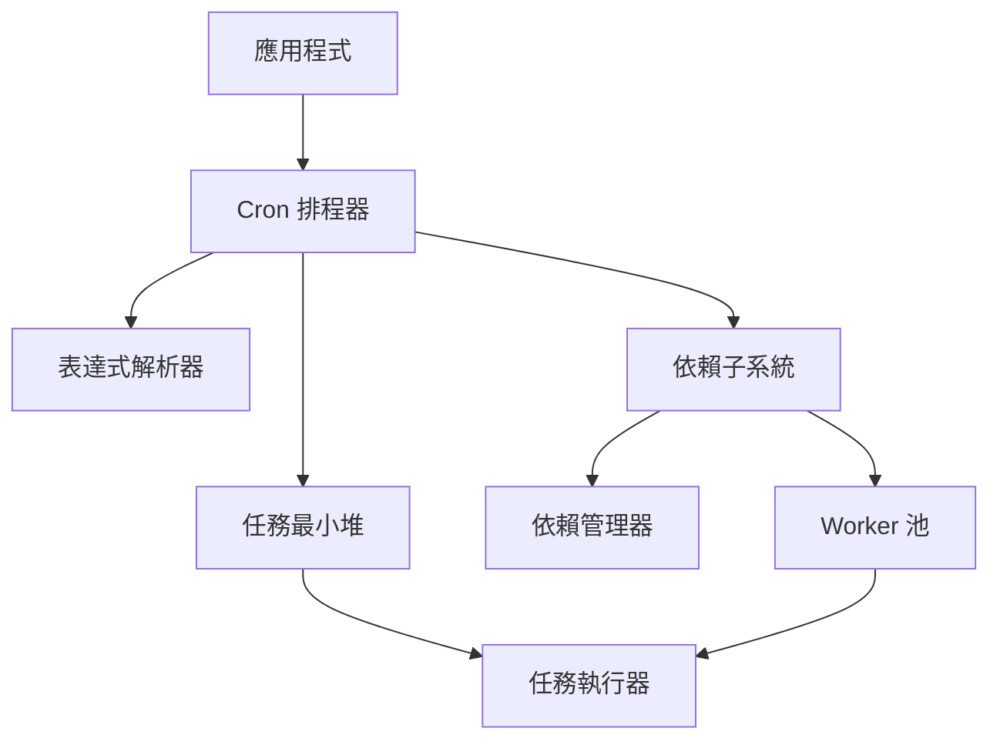
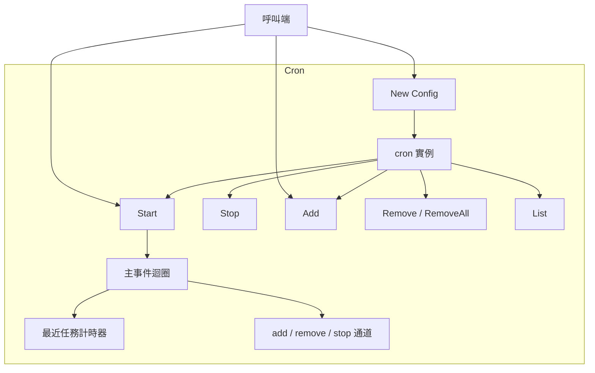
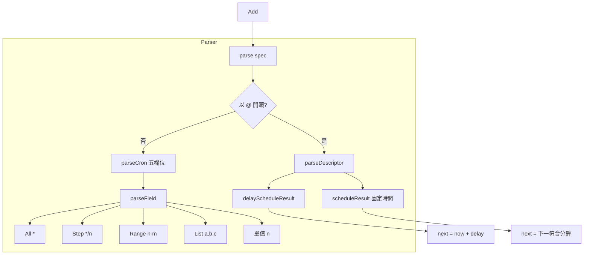
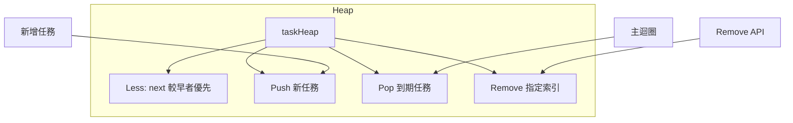
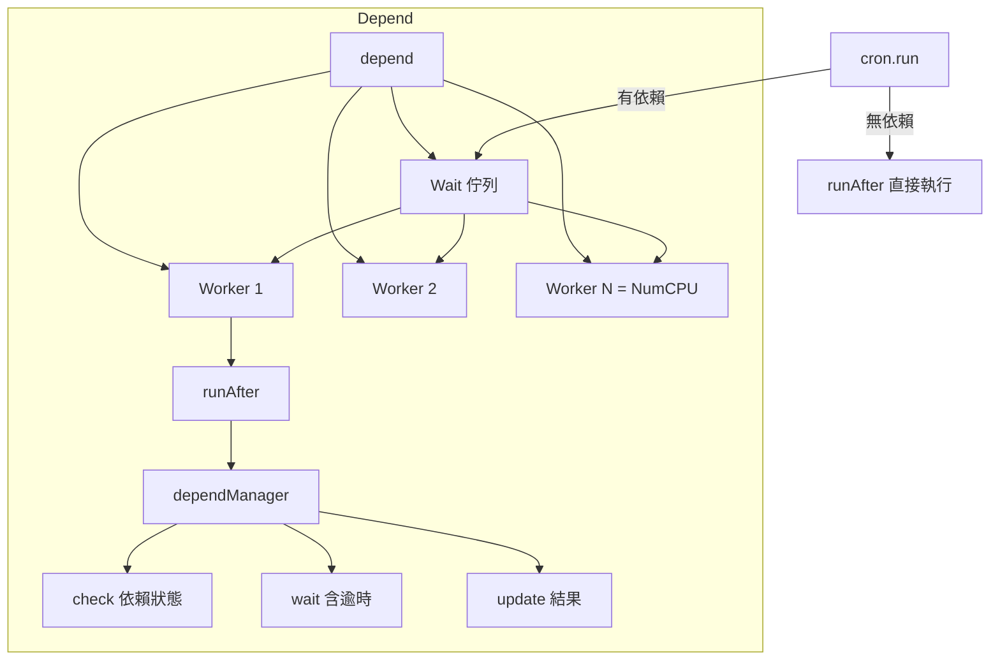
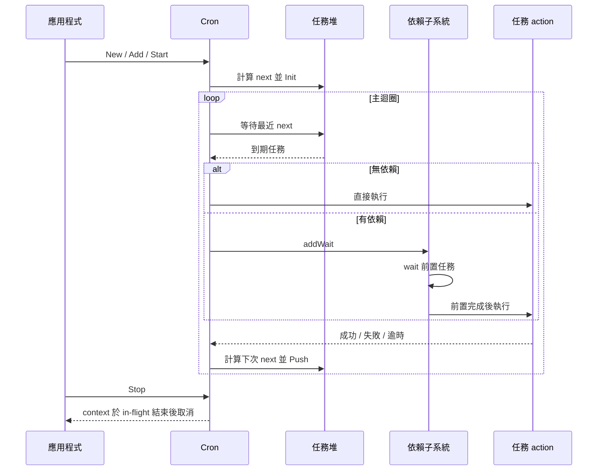
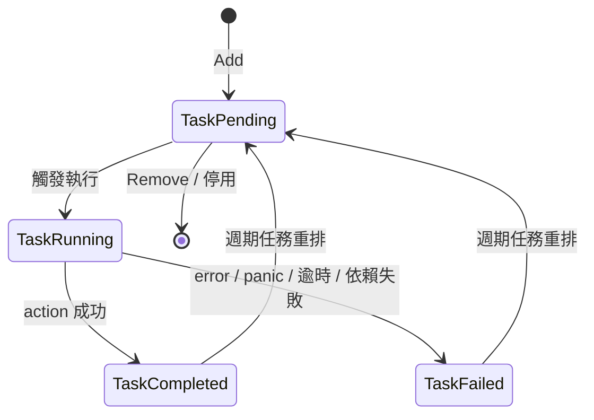

# go-scheduler - 架構

> 返回 [README](./README.zh.md)

## 概覽

## 模組：Cron 排程器

負責生命週期、任務登錄與時間觸發的主迴圈。

## 模組：表達式解析器

將字串規格轉成 `schedule` 介面實作。

## 模組：任務最小堆

以 `next` 時間排序，確保主迴圈永遠處理最近到期的任務。

## 模組：依賴子系統

當任務具有 `after` 依賴時，由 worker 池等待前置完成再執行。

## 資料流

## 狀態機

***

©️ 2025 [邱敬幃 Pardn Chiu](https://linkedin.com/in/pardnchiu)
