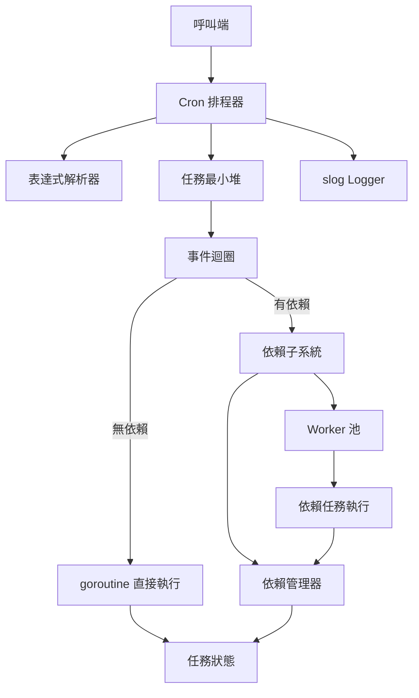
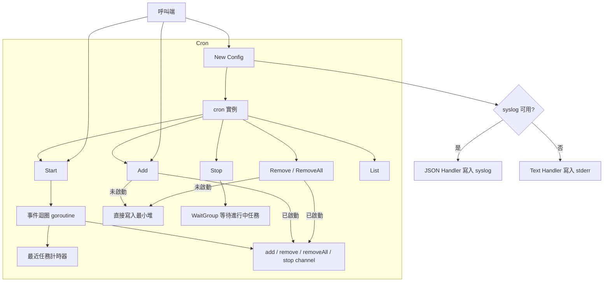
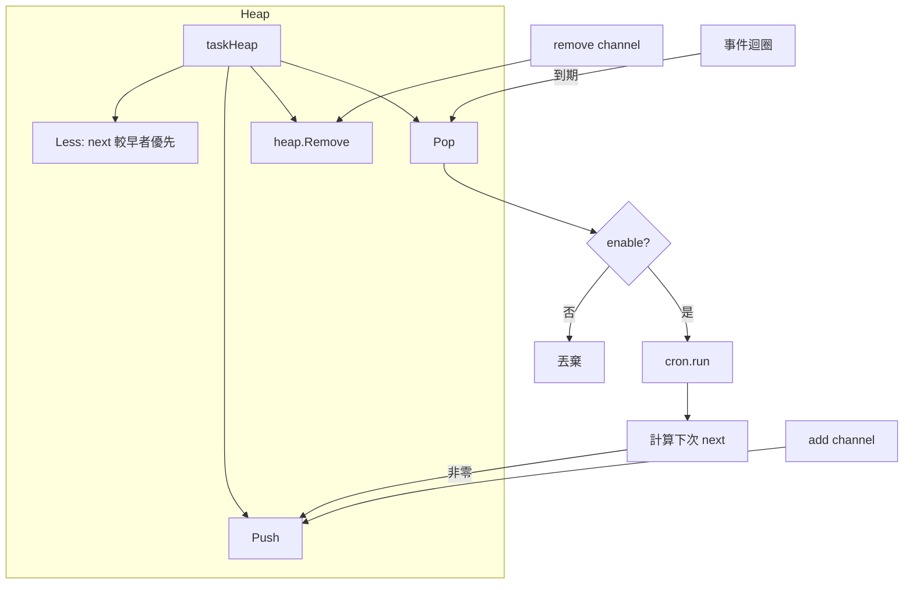
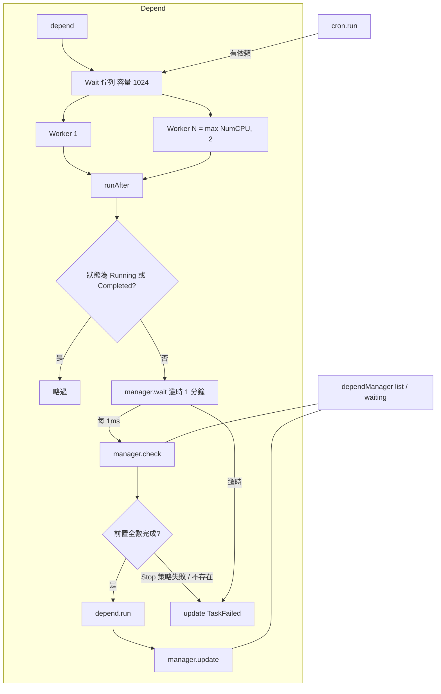
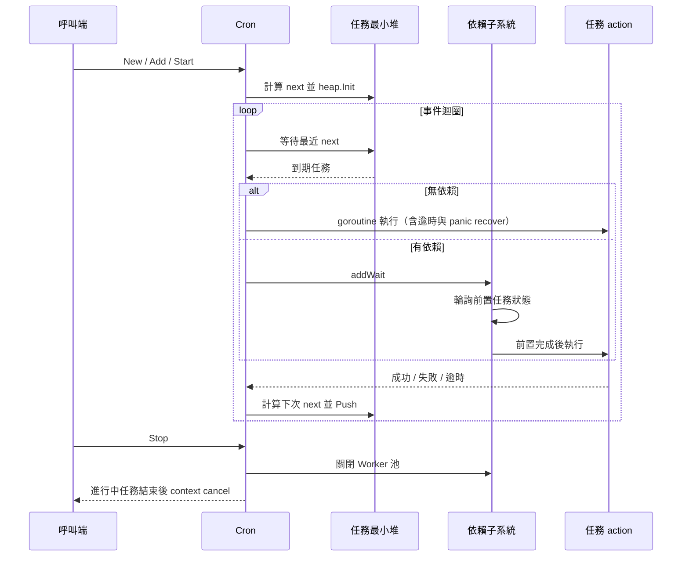
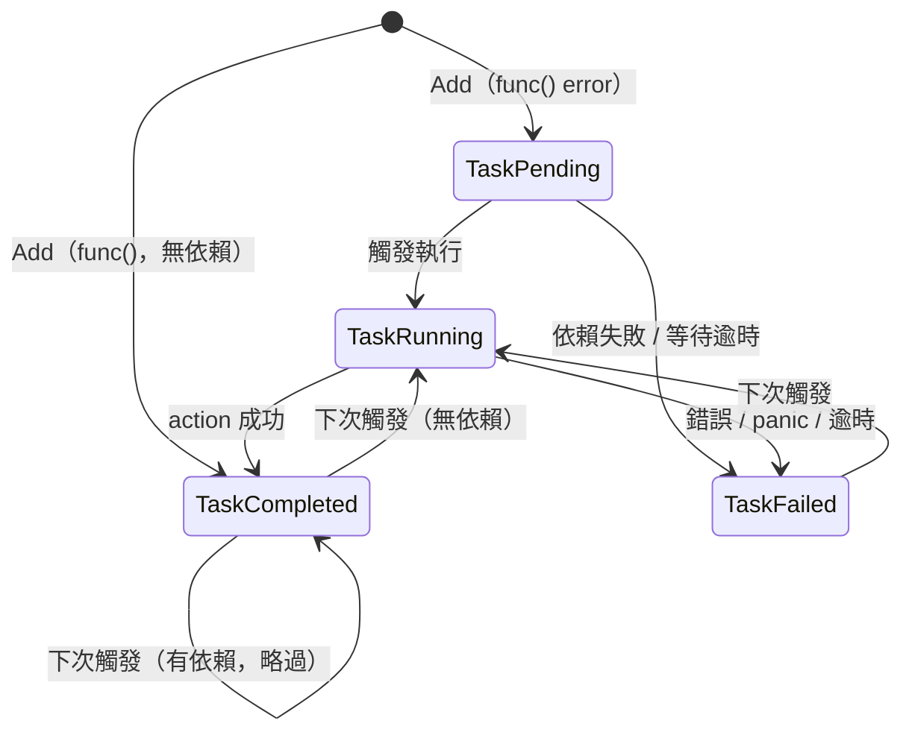

# go-scheduler - 架構

> 返回 [README](./README.zh.md)

## 概覽

```mermaid
graph TB
    App[呼叫端] --> Cron[Cron 排程器]
    Cron --> Parser[表達式解析器]
    Cron --> Heap[任務最小堆]
    Cron --> Logger[slog Logger]
    Heap --> Loop[事件迴圈]
    Loop -->|無依賴| Runner[goroutine 直接執行]
    Loop -->|有依賴| Depend[依賴子系統]
    Depend --> Manager[依賴管理器]
    Depend --> Workers[Worker 池]
    Workers --> DepRunner[依賴任務執行]
    Runner --> State[任務狀態]
    DepRunner --> Manager
    Manager --> State
```

## Module: Cron 排程器

負責生命週期、任務註冊與時間驅動的事件迴圈。

```mermaid
graph TB
    subgraph Cron
        New[New Config] --> Instance[cron 實例]
        Instance --> Start[Start]
        Instance --> Stop[Stop]
        Instance --> Add[Add]
        Instance --> Remove[Remove / RemoveAll]
        Instance --> List[List]
        Start --> Loop[事件迴圈 goroutine]
        Loop --> Timer[最近任務計時器]
        Loop --> Channels[add / remove / removeAll / stop channel]
        Add -->|已啟動| Channels
        Remove -->|已啟動| Channels
        Add -->|未啟動| HeapDirect[直接寫入最小堆]
        Remove -->|未啟動| HeapDirect
        Stop --> WaitGroup[WaitGroup 等待進行中任務]
    end
    App[呼叫端] --> New
    App --> Start
    App --> Add
    New --> Syslog{syslog 可用?}
    Syslog -->|是| JSON[JSON Handler 寫入 syslog]
    Syslog -->|否| Text[Text Handler 寫入 stderr]
```

## Module: 表達式解析器

將字串規格轉為 `schedule` 實作。

```mermaid
graph TB
    subgraph Parser
        Parse[parse spec] --> IsDesc{以 @ 開頭?}
        IsDesc -->|是| Desc[parseDescriptor]
        IsDesc -->|否| Cron5[parseCron 五欄位]
        Desc --> Every{@every?}
        Every -->|是 且 >= 30s| Delay[delayScheduleResult]
        Every -->|否| Fixed[scheduleResult 固定欄位]
        Cron5 --> Field[parseField]
        Field --> All[* 全部]
        Field --> Step[*/n 步進]
        Field --> List[a,b 列表 parseList]
        Field --> Range[n-m 範圍 parseRange]
        Field --> Value[n 單值]
        List --> Range
        Field --> Result[scheduleResult]
    end
    Add[Add] --> Parse
    Delay --> Next1[next = now + delay]
    Fixed --> Next2[逐分鐘遞增直到五欄位皆符合]
    Result --> Next2
```

## Module: 任務最小堆

依 `next` 排序，使事件迴圈永遠先處理最近到期的任務。

```mermaid
graph TB
    subgraph Heap
        H[taskHeap] --> Less[Less: next 較早者優先]
        H --> Push[Push]
        H --> Pop[Pop]
        H --> Remove[heap.Remove]
    end
    Loop[事件迴圈] -->|到期| Pop
    Pop --> Enabled{enable?}
    Enabled -->|否| Drop[丟棄]
    Enabled -->|是| Run[cron.run]
    Run --> Reschedule[計算下次 next]
    Reschedule -->|非零| Push
    AddCh[add channel] --> Push
    RemoveCh[remove channel] --> Remove
```

## Module: 依賴子系統

有依賴的任務進入佇列，由 Worker 池輪詢前置任務狀態後才執行。

```mermaid
graph TB
    subgraph Depend
        D[depend] --> Queue[Wait 佇列 容量 1024]
        Queue --> W1[Worker 1]
        Queue --> Wn[Worker N = max NumCPU, 2]
        W1 --> RunAfter[runAfter]
        Wn --> RunAfter
        RunAfter --> Skip{狀態為 Running 或 Completed?}
        Skip -->|是| Ignore[略過]
        Skip -->|否| WaitDeps[manager.wait 逾時 1 分鐘]
        WaitDeps -->|每 1ms| Check[manager.check]
        Check --> Done{前置全數完成?}
        Done -->|是| Exec[depend.run]
        Done -->|Stop 策略失敗 / 不存在| Fail[update TaskFailed]
        WaitDeps -->|逾時| Fail
        Exec --> Update[manager.update]
    end
    CronRun[cron.run] -->|有依賴| Queue
    Manager[dependManager list / waiting] --- Check
    Manager --- Update
```

## 資料流

```mermaid
sequenceDiagram
    participant App as 呼叫端
    participant Cron as Cron
    participant Heap as 任務最小堆
    participant Depend as 依賴子系統
    participant Task as 任務 action

    App->>Cron: New / Add / Start
    Cron->>Heap: 計算 next 並 heap.Init
    loop 事件迴圈
        Cron->>Heap: 等待最近 next
        Heap-->>Cron: 到期任務
        alt 無依賴
            Cron->>Task: goroutine 執行（含逾時與 panic recover）
        else 有依賴
            Cron->>Depend: addWait
            Depend->>Depend: 輪詢前置任務狀態
            Depend->>Task: 前置完成後執行
        end
        Task-->>Cron: 成功 / 失敗 / 逾時
        Cron->>Heap: 計算下次 next 並 Push
    end
    App->>Cron: Stop
    Cron->>Depend: 關閉 Worker 池
    Cron-->>App: 進行中任務結束後 context cancel
```

## 狀態機

```mermaid
stateDiagram-v2
    [*] --> TaskPending: Add（func() error）
    [*] --> TaskCompleted: Add（func()，無依賴）
    TaskPending --> TaskRunning: 觸發執行
    TaskPending --> TaskFailed: 依賴失敗 / 等待逾時
    TaskRunning --> TaskCompleted: action 成功
    TaskRunning --> TaskFailed: 錯誤 / panic / 逾時
    TaskCompleted --> TaskRunning: 下次觸發（無依賴）
    TaskFailed --> TaskRunning: 下次觸發
    TaskCompleted --> TaskCompleted: 下次觸發（有依賴，略過）
```

***

©️ 2025 [邱敬幃 Pardn Chiu](https://www.linkedin.com/in/pardnchiu)
